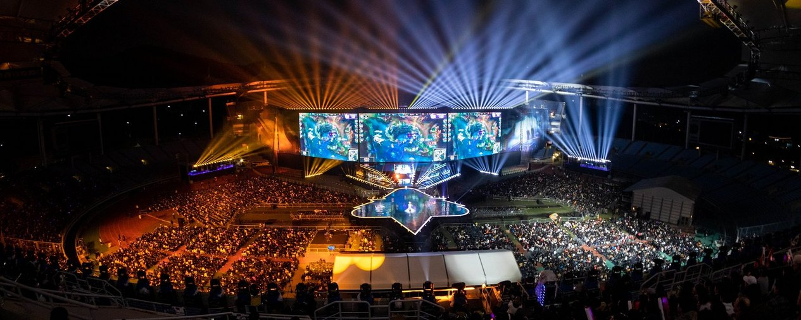
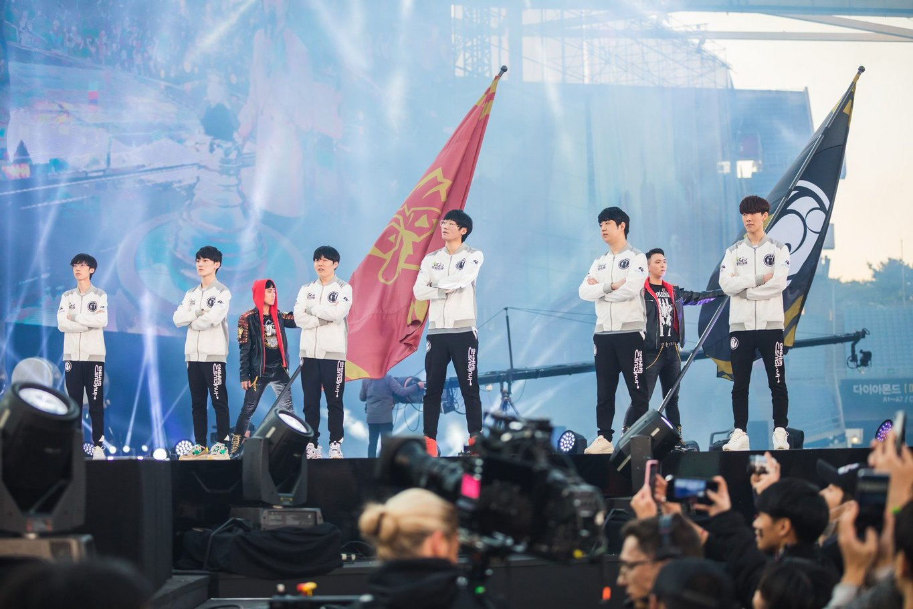

<!-- markdownlint-disable MD033 -->

#AN LPL FIRST: INVICTUS GAMING WINS IT ALL

By far the largest region in the world, the LPL is a league rife with a history of disappointment. Be it the back-to-back Finals defeats they suffered in 2013 and 2014 or the the string of failures from their biggest teams in the years that followed, it seemed like the Worlds title was destined to be something they would only ever have a front row seat to look at. For IG especially -- a team older than the LPL itself -- the thought of a Championship was nothing but a dream.

Despite dominating the regular season this year, they fell short in both the LPL Spring Split Playoffs and the Summer Playoffs. Trace back their year and you will find images of mid laner Rookie crying, TheShy nursing an injury, and a young JackeyLove struggling to step up in the biggest moments. All of that culminated in a Worlds where they were considered the undercard to the LPL favorite, RNG. When RNG fell unexpectedly, though, suddenly all of China turned to IG as IG continued to look forward.

Despite shows of bravado from Fnatic prior to the series, it was IG who would live up to the expectations. All year they’ve relied on the individual prowess of their solo laners -- TheShy and Rookie -- and this series was no different.

Game 1 seemed to be a classic case of having a lot of physical damage into a lot of tanky boys. The early game tilted into IG’s favor thanks to a big focus on camping Caps, who seemed to be caught in the middle of a trade one too times. It seemed whenever he would dash up, IG would be there to spring their trap. This eventually led to IG taking both mid turrets before 15 minutes. From there, the game just snowballed as IG was able to rotate to every single objective before FNC thanks to the turret advantage in mid lane. A Baron buff later and the Nexus would follow.

Fnatic looked to bounce back in Game 2 by opting into a couple of slow-to-scale champions in Azir and Ezreal, and while Caps managed to find more success in the mid game, IG would simply turn their eyes towards top lane. Ning -- having already won Player of the Game in the first game -- continued his rampage in the Finals by body slamming top lane into the dirt. Together with TheShy, the two exposed Bwipo in a way that we haven’t seen all tournament. By continuously camping that lane, they managed to put TheShy’s Irelia into an unmatchable state in the game.

A heroic Baron attempt from Fnatic secured the objective for them, but they lost all of their members for it. Everyone on IG stepped up in this game -- JackeyLove and Baolan continued to show much more pressure on the map thanks to the avenues created by their team and Rookie was as reliable as always. IG choked out the game and bullied Fnatic into the corner of their base before destroying the Nexus to also take Game 2.

And with their backs against the wall, Fnatic turned to one of the longest-tenured players not just in professional play, but in League of Legends, period. sOAZ was summoned to replace Bwipo and hopefully spark some life into the Fnatic roster -- it seemed to work at first when they managed a cheeky Level 1 kill onto Caps, but the highlight reel would essentially end there. Fights continuously went against Fnatic, and even when they did manage to find kills, IG was taking something back on the other side of the map.

The height of this is when Fnatic managed to blindly steal Baron from IG -- even though they followed it up with a team fight win, it was IG who would dictate the pace around the map. What was supposed to be a turn for FNC only made it all too clear they were outclassed today by IG, who just continued to barrel down the lanes to demolish the FNC structures, champions, and eventually their Nexus.

Immediately after winning, you could see just how meaningful this was for the entire team, but for Rookie especially. He ran to each teammate and hugged them like a dog trying to decide which person to hug, and once that settled down, he turned towards himself and cried. It’s been four years since he’s won anything of significance, and having tasted that high once, I imagine a part of him wondered if he would ever taste it again. This win, of course, must taste better than anything he’s ever experienced before.

The LPL has dominated international play this year -- they’ve won absolutely everything they’ve taken part in, and we may now be entering their era. All other regions may now have to look up at the behemoth that is China and the LPL -- their massive pool of talent, increasingly robust infrastructure, and now newfound confidence will be a tall wall to climb. That IG sits at the top of that wall is, perhaps, a little unexpected -- but there is no question now as to whether or not it is deserved.

Four years ago on a beach in Busan, Rookie lifted his first trophy. A part of him must have seen this future. He must have envisioned himself standing atop every other player in the world. He never could have imagined it would take four years, though. And he never could have imagined that it would be for the LPL, who now reign over us all. 
