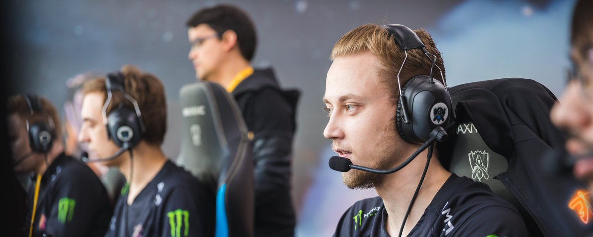
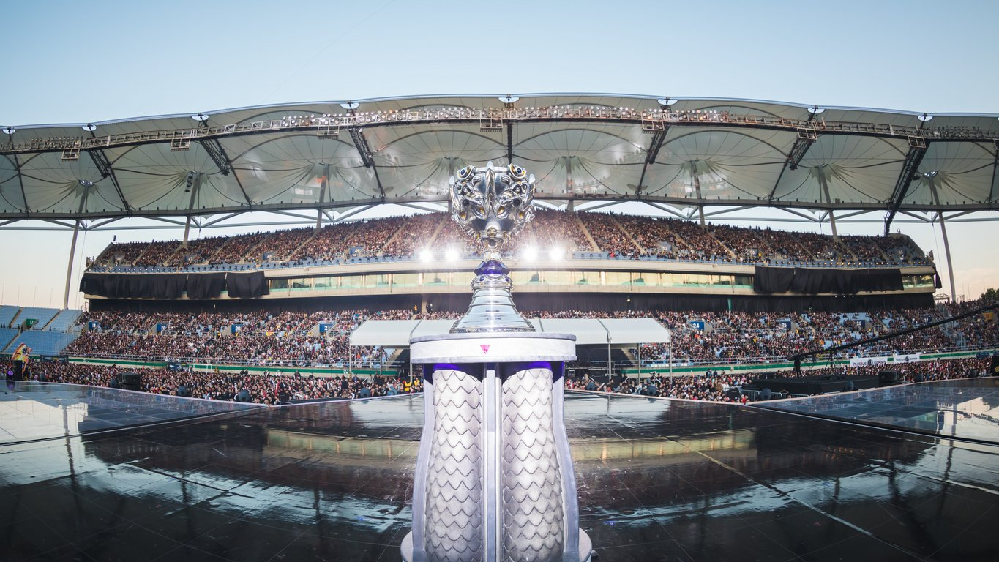

<!-- markdownlint-disable MD033 -->

#FNATIC FELL, BUT THEIR WORLDS STORY PAINTS A BRIGHT PICTURE FOR EUROPE

The 2018 League of Legends World Championship has been a tournament of upsets. Korea crumbled, the Chinese favourites crashed out, and the West rose higher than ever before.

Fnatic smashed through 100 Thieves and G-Rex, knocked out EDward Gaming and Cloud9, and even beat their Grand Final opponents Invictus Gaming twice during the Group Stage. History was on their side too, as Fnatic were the first ever winners of Worlds back in 2011. That may have been a long time ago, and times have changed, but this year’s tournament has proven Europe have the ability to get back to the top of the game, and soon. 

As The Glitch Mob, Mako, and The Word Alive performed the song Rise while Fnatic and Invictus Gaming quite literally rose above the crowd during the opening ceremony, the fans at Worlds 2018 knew they were in for something special. Unfortunately for European fans, Martin "Rekkles" Larsson and the rest of Fnatic couldn’t quite deliver on the day – but an EU team in the final once again is a sure sign of what’s to come. Let’s break it down game by game.

##GAME 1

Allowing Mads "Broxah" Brock-Pedersen to play Lee Sin could be seen as a show of strength, or it could be a complete mistake, and Game 1 would quickly prove which side IG fell on.

Neither team opted for a cagey start, instead skirmishing with each other barely after minions had arrived in lane. There were a couple of early close calls, but first blood didn’t arrive until 10 minutes into the game. Rasmus "Caps" Winther thought he might be able to turn around a gank with Broxah arriving, but the damage of Camille and Lissandra was too much and Lee Sin arrived slightly too late to have the required impact. 

Caps got caught out in the mid lane again with a collapse from four members of IG, and they grabbed both mid towers off the back of it, giving Invictus a firm early advantage. A fight around Rift Herald also went the way of IG, and Caps’ K/D/A of 0/3/1 at 15 minutes wasn’t a pretty picture for the European team.

The situation went from bad to worse as IG stormed down the bottom lane. Desperately behind, and without any good way to engage on their enemies, Fnatic had to give up another couple of turrets. 

Objective after objective fell, including Baron around the 25 minute mark, and IG’s kill count skyrocketed too. A quadra kill from Wen "JackeyLove" Bo Yu on Kai’Sa sealed the deal, and the game was over soon after. A dominating performance from the Chinese team, who out-drafted, and outplayed their opponents.

##GAME 2

Game 2 didn’t start well for Fnatic sadly, with First Blood going over to Invictus Gaming in the top lane, and a repeat gank a few moments later sent Gabriel "Bwipo" Rau into dire straits. Fnatic were agonisingly close to a kill, but Gao "Ning" Zhen-Ning got away on a sliver of health. Broxah and Bwipo were just about able to stem the bleeding in the top lane, but the early game once again belonged to Invictus.

Instead of Rift Herald, this time the big first team fight happened in the Dragon pit, with IG taking the objective and a kill for good measure. Everywhere Fnatic turned, IG were there to take everything away from them. A kill from Caps was turned around into a double kill for Ning. Just like in the first game, Fnatic were forced to give up turrets while IG ran riot in their back line.

Seung-Lok "TheShy" Kang overstaying in the bottom lane to get shut down gave Fnatic a lifeline, but at this point, IG’s gold lead was giant. A bit of misdirection meant Fnatic were able to sneak a Baron kill, but at the cost of their lives, and IG stormed into their base off the back of it. The lack of Baron empowered minions did mean the base turrets were a little tougher than normal to crack. The sheer weight of IG’s lead was too much though, and the Nexus finally fell at 33 minutes.

##GAME 3

With Paul "sOAZ" Boyer in the lineup, subbing in for Bwipo, and Fnatic on the Red side, it was all change in Game 3. Broxah went onto Jax, Caps went onto Victor, and the Europeans finally managed to get their first First Blood of the night, giving EU fans hope. 

Early in the game, ganks were finally working, and Fnatic were surviving when Ning came knocking. However, Invictus were keeping the game even, picking up a few kills of their own. Unfortunately for Fnatic, that’s when IG started taking over. 

Although Fnatic made Game 3 more competitive, Invictus continued their ruthless form over from the first two games. In an extremely bloody and fast paced game, the style seemed to fit the Chinese team, and JackeyLove went legendary on Kai’Sa in quick fashion. 

Fnatic fans roared as Broxah jumped into the Baron pit and stole away the buff, as Fnatic tried to pull things back in the final. However, despite the heroic play, IG’s gold lead was still over 5,000 at 23 minutes into the game. Even without Baron, IG stormed Fnatic’s base without much resistance.

European hopes ended for another year as the base fell, and JackeyLove capped off an amazing finals performance by going 13/0/7.

##HOPE

Although they couldn’t live up to expectation in the Grand Final, the rest of the tournament showed that the West has closed the gap on the East. There was even a chance that the final would be an all-European affair, making clear that the West’s success this year was not at all a fluke. 

The current Fnatic lineup is undoubtedly the strongest team Europe has ever produced. Their road through both the EU LCS and for the majority of Worlds has been ruthless, to the point where they were considered even with, if not better than Invictus Gaming. 

Perhaps on another day, with some different draft picks, things would’ve gone very differently. Overall they have a very young lineup too. Fnatic, and the rest of Europe, will be back next year. They’ll be on home turf, and hungry to go all the way.