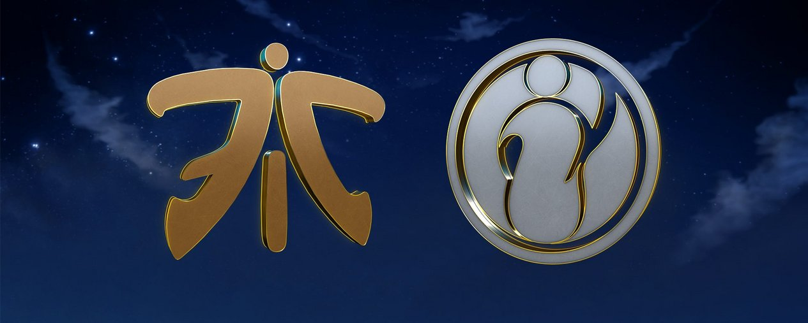
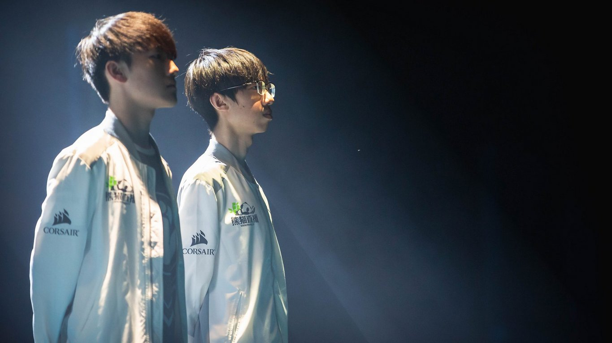
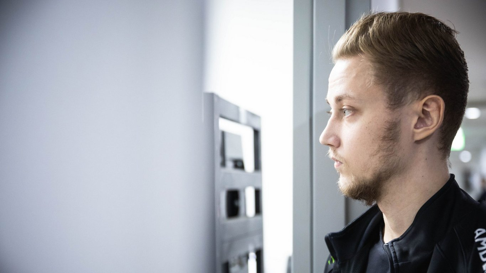
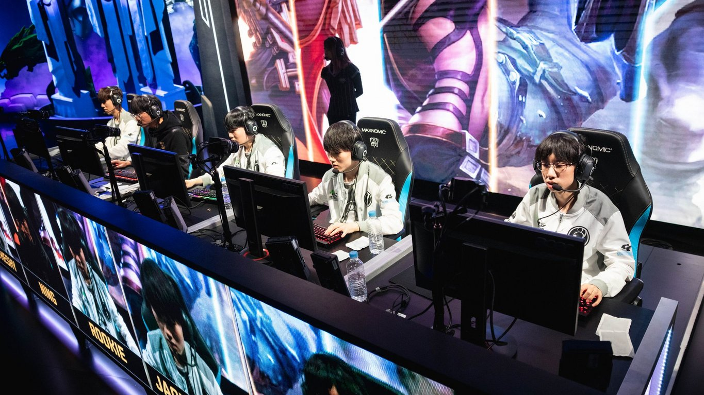

<!-- markdownlint-disable MD033 -->

#THE RIGHT LESSONS: FNATIC AND INVICTUS GAMING'S RISE TO THE 2018 FINAL

The Chinese and European rivalry has roots extending far back before the age of the LCS. The largest will-they-or-won’t-they candidates came from the two largest base population regions and battled Korean teams before they rose to unquestionable prominence.

Only one organization at the 2018 World Championship from each region really remembers the age of the open circuit tournament. Only Fnatic can remember the iconic IGN Pro League 5, and only Invictus Gaming attended the Season 2 World Championship. Both organizations waited years to definitively topple South Korean teams when their dominance was still testable.

That both Fnatic and Invictus Gaming emerged when the LCK looks its weakest and no South Korean team advanced beyond the quarterfinal feels too poetic. Patience and rebuilding yielded fruit, and organizational experience comes to the forefront in a battle between two rosters full of young talent. Europe and China have always been the real Rift Rivals, and it’s only fitting that they two teams with the longest memory of the rivalry will decide who inherits the international throne and crowns his region the best of 2018.

##FIRST SUCCESSES IN THE ERA OF LOL'S INFANCY

Both Fnatic and Invictus Gaming have exhaustive histories in the League of Legends space. Both teams purchased existing promising rosters when they entered the LoL scene in 2011. For Fnatic, an acquisition of the myRevenge roster after the team’s victory a month earlier at IEM Season V Hanover mirrors Invictus Gaming owner Wang Sicong’s approach to purchasing the champions of the first ever Tencent Games Arena in 2011, then known as Catastrophic Cruel Memory.

For both teams, initial success petered out. Fnatic won the first ever Riot-sponsored League of Legends season Championship, and iG qualified as China’s representative at the first ever LoL World Cyber Games, giving them the distinction of being the first ever team to represent China against broader international competition.

But both teams struggled immediately after success as a result of roster changes. For both teams, it took the signing of extremely green talent to put them back into contention for best in the world.

Luck struck first for Invictus Gaming. Liu “Zzitai” Zhi-hao and Ge “Kid” Yan both joined iG at the age of 14. Combined with the departure of iG’s more experienced leaders, Lo "Wh1t3zZ" Pun Wai and Wong “Tabe” Pak Kan, gave iG a more aggressive and surprising identity. This team didn’t hold back in its attempt to dominate through laning phase. That made it both more aggressive and more unreliable. Even after numerous roster changes, the org has sought similar players, and the identity has stuck.

The new injection of young players gave Invictus Gaming enough of an oomph to qualify for the Season 2 World Championship, where they encountered two European teams. iG beat SK Gaming in the Group Stage, but were crushed by Moscow 5 in the bracket stage in the mid-to-late game when early advantages faltered. Highlights of Moscow 5's comeback fights still make their way into montages.

Fnatic didn’t find their Season 2 stride until after the World Championship with the addition of their own new extremely young talent. Martin “Rekkles” Larsson wasn’t quite as young as Kid and Zzitai. He joined Fnatic after just barely turning 16. With Rekkles, Fnatic won Dreamhack Winter 2012, defeating the then-prominent CLG EU in the final.

With this strong showing and both Against All Authority and Eclypsia unable to attend IGN Pro League 5, Fnatic had a last minute chance to play against a Chinese team in 2012 by happenstance. Fnatic’s unexpected attendance brought them all the way to the Grand Final. During their tenure, Fnatic lost five games in total to the rising Chinese powerhouse and IPL 5 champions, Team WE, and only won two.

Both Fnatic and Invictus Gaming played pivotal games in 2012 against rivals in China and Europe and lost. Since then, both teams have retained identities that have aided them in the 2018 World Championship. Paul “sOAZ” Boyer and Enrique "xPeke" Cedeño Martínez gave Fnatic solo lane power, and Liu "PDD" Mou and Zzitai did the same for iG.

For years after 2012, however, Invictus Gaming struggled. In 2013, iG had their pivotal victory over Team WE in StarsWar League Season 2 Grand Final, ending one of the most dominant streaks in Chinese LoL history. They placed first in the regular season in 2013 Spring, but lost out in Playoffs to Positive Energy and didn’t have nearly as respectable a performance in Summer. Oh My God seemed like the favorites, but AD carry itemization gave Jian “Uzi” Zi-hao of Royal Club Haung Zu agency. Oh My God and Royal Club Huang Zu advanced to the 2013 World Championship over iG.

Unlike iG, Fnatic continued to find domestic success. Even though minimum age requirements prevented Fnatic from starting Rekkles in the LCS in 2013, the team eventually settled on a bottom lane of Johannes "puszu" Uibos and Bora “YellOwStaR” Kim. This duo should have allowed Fnatic’s solo lanes to flourish, but Royal Club Huang Zu’s Wh1t3zZ found a surprising advantage that facilitated a Chinese series victory over a European team for the first time ever at a World Championship.

One of Fnatic’s most explosive and memorable encounters against a Chinese representative occurred in 2014. Likely one of the worst players to ever represent China at a World Championship, Fang “Dada777” Hong-ri started for Oh My God in the 2014 Group Stage. In a 71 minute and 34 second game with multiple attempts at both nexuses, OMG triumphed over Fnatic with Dada777 to advance to the Quarterfinal.

##THE FIRST ENCOUNTER

Fnatic took the failure to heart and completely rebuilt their roster for 2015. That was the first time Fnatic would play against Invictus Gaming.

After years of coming just short since 2012, Invictus Gaming made one of the boldest moves in a sea of bold moves for Chinese teams prior to the 2015 season. The two players of significant performance to announce a move to the LPL were Lee “Kakao” Byung-kwon and Song “Rookie” Eui-jin. Kakao and Rookie had just won the 2014 OGN Champions Summer, so the idea that they couldn’t have been domestically successful evaporated. iG had all-inned to bring proven Championship talent to China.

Rookie and Kakao represented iG the next year in the 2015 World Championship. Many projected the Chinese team to advance from Group Stage in first, especially after EDward Gaming won the first ever Mid Season Invitational in 2015. Fnatic, Cloud9, and ahq-Esports had more to say about iG’s chances. In the conclusion of Week Two, iG finished the Group Stage in last place, winning against Cloud9 and ahq e-Sports in Round Two, but losing both games to Fnatic.

Fnatic had the superior approach to lane swaps, moving Rekkles, YellOwStaR, and Heo "Huni" Seung-hoon before iG could react. Korean and Chinese teams often started supports with their top laners and didn’t consider the bouncing of top or bot wave to set up a lane swap. Zzitai easily fell behind Huni in the top lane, and Fnatic pushed iG out of the tournament all together. Fnatic then went on to overcome the LPL first seed, EDward Gaming, at the event in a best-of-five.

Again, Fnatic and Invictus’ Gaming’s rebuilding period coincided. Unlike iG, however, Fnatic continued to find rookie players in Fabian "Febiven" Diepstraten and Huni for firepower, relying on the more experienced YellOwStaR and Kim "Reignover" Yeu-jin for leadership. Fnatic stuck to formula in raising its own talent, while iG bought into importing two star Koreans as carries.

But rather than keep that message in mind, Fnatic and iG both made awkward changes to their rosters for the 2016 season. Fnatic signed ex-Dignitas top laner Noh “Gamsu” Yeong-jin and impressive high farm jungler Lee “Spirit” Da-yoon to replace Huni and Reignover.

Despite a promising Spring Split where Fnatic triumphed again over Chinese opposition, but lost to SKT, at the IEM World Championship and advanced all the way to the semifinal against G2 Esports in EU LCS, the team didn’t reach the heights to which it had grown accustomed in 2015. Additional roster changes left the team in disarray, and the removal of lane swaps prior to the Summer Playoffs meant that Fnatic’s poor laning phase play and low jungle pressure shone through glaringly against H2K-Gaming. Fnatic were then unceremoniously dismantled by Unicorns of Love and didn’t advance to the World Championship for the first time since 2012.

While Fnatic’s stops and stutters seemed awkward, Invictus Gaming’s disaster of a 2016 season verged on comical. The departure of KaKAO meant Kid rotated to the jungle position, and iG signed An "Rain" Hyeon-guk, who gave one of the worst performances by an LPL AD carry. iG’s bottom lane turmoil continued, and they went through four different supports and three different AD carries throughout the course of the 2016 season.

One of iG’s more unbelievable rosters played for a single series in Summer against I May. Baek “Save” Young-jin returned briefly to the team to play the top lane role after spending time on iG’s LSPL sister team, Young Glory. Zzitai switched back to the mid lane after nearly two years as a top laner. Kid played jungle. Rookie played AD carry alongside returning iG veteran Tabe in as support. iG still managed to take the series to three games against the LPL’s eventual third seed representative at Worlds.

But through the chaos of Invictus Gaming’s 2016 season, they had a trump card prepared. Young AD carry Yu “JackeyLove” Wen-bo signed with the team on June 22 at the age of 15: far earlier than he would be eligible to play on stage. That one small investment would pave the way for iG to begin turning their fortunes around in 2017.