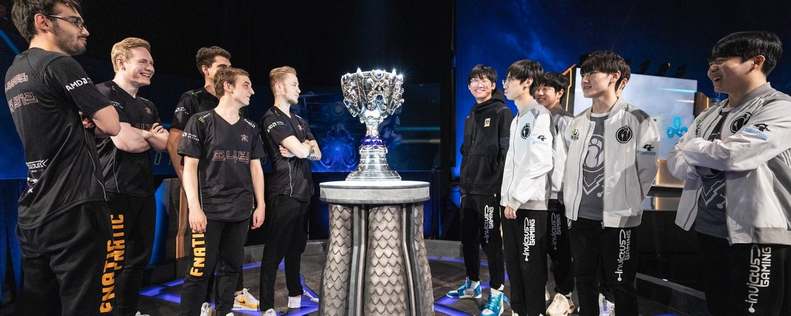
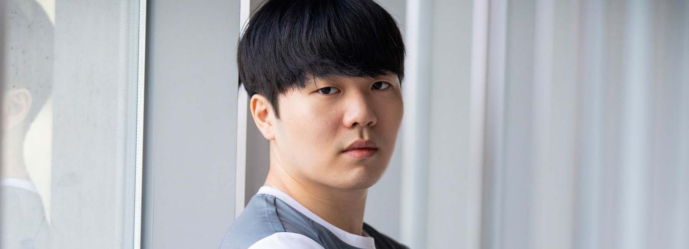
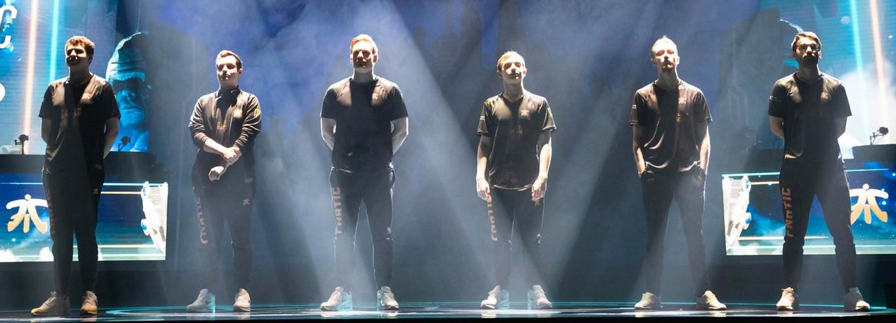

<!-- markdownlint-disable MD033 -->

#FINAL DIFFERENCES: FNC VS. IG

I saw a glimpse of how I wanted this Worlds Finals to conclude when the Red Sox’s Ian Kinsler threw a routine ground ball 10 feet off the mark to extend the game against the Dodgers. It was a play he probably completes 99 times out of 100 -- it is so ordinary we would never talk about it again. It just disappears into the books. Instead we got the one that would take the game into the 18th inning, where the Red Sox would lose. And in the movie version for the Dodgers, they would rally to win the series and this 18 inning epic would be remembered forever. But we do not live in the movie version.

As we saw so clearly when KT’s star top laner Smeb teleported into the IG base at the last second of Game 3 in the Quarterfinals to secure a photo-finish victory for the often-tragic organization. It was so close that even the observer was briefly confused about where to look, and for a second, time itself slowed down as the camera panned up to the broken IG Nexus. You can pause on that exact moment KT fans let themselves believe this to be their year. And in the movie version of KT Rolster’s run, you can pause right there forever.

But both of these teams would go on to lose their respective series. That’s how this thing goes sometimes. The spurts of heroism make it seem like there are protagonists and antagonists in sports -- it is easier for us to root for our teams if we can make the opponent out to be a villain. It is easier to imagine them as a monster instead of imagining their fans slumped in disbelief in their chairs, their flags pointed at the ground, and their banners abandoned to walls like propaganda from a fallen regime.

All of this becomes more devastating as the stakes get higher. In a 3-0 defeat, you’re allotted some time to collect yourself and prepare for the loss -- you figure there wasn’t anything your team really could have done anyway. But a game win and especially two is a peek into a parallel universe where a happier version of yourself exists. A fifth game brings both fan bases into a sort of ripple in time where they simultaneously anticipate both possible outcomes.

What you get with a fifth game is the desire to see it both end and to see it go on forever. You want it to stretch into the 18th inning because as long as the game continues, it means you haven’t lost. But because you also haven’t won, you want it to end like a child who looks away when a doctor inserts a needle into their arm. Is it over yet you might ask. Did we win yet asked the KT fan.

A fifty-fifty match with no definitive favorite is the Finals we are gearing up for on Saturday. Fnatic and Invictus Gaming are the most evenly matched teams we’ve ever had in a Worlds Finals, and we may very well get our fifth game. I think of this matchup as the final turns in a game of Jenga -- we’ve already seen some gutsy blocks removed from the structure, so now there is so much riding on these wobbly last pulls.

China is seeking its first Worlds title. They have lost twice on this Finals stage before. Last year they watched two of their teams fall in Shanghai. And Invictus Gaming specifically lost their last match to end the Spring Split and the last match of their Summer Split. If stories consist of beginnings, middles, and ends, then perhaps their outcome is already laid out in front of us. But maybe this is the twist ending that this Worlds has been hinting at all along.

As for Fnatic, they will try to bring it home to Europe after winning in 2011. In the seven years since, thousands of players have come into professional League of Legends. Thousands of them have fought to stand on this stage, and thousands of them have failed. Including Fnatic. They’ve fallen in the Semifinals twice before this, but now they’re in the midst of a potentially legendary run where they’ve even already bested IG. They’ve already seen the path to the top, and they know what it might feel like to win.

Now we will see what difference between the two is -- how slim the margin and how slim the line they’ll need to toe. They are searching for that edge, and they will hold onto it like the game could never end. There is just so much they are playing for -- it is hard to know who to pull for, so here is my feeble attempt at making a case for both teams.

##1. THE CASE FOR IG
At a budae-jjigae restaurant in Seoul, Rookie and a few IG players get up to leave just as my friend and I receive our food. He comes over and waves enthusiastically while telling us our food choice was good. Two thumbs up. Seeing someone he recognizes in the wild appears to be just as exciting for him as it is for us. The difference, of course, is he’s now one of the most famous players in the world, and we are decidedly not.

Later, he tells me, “So to be honest, I’m actually a gamer boy so I don’t really go out except to eat, so I don’t have any special memories [from this Worlds]. But this is my first Finals, so I just want to do my best.”

While I think eating with his team is good enough for memories, I expect standing on the Finals stage in Incheon will be his greatest memory yet -- if only temporarily pending the result. And his play, at least, has been memorable. Rookie ranks 1st among all players at CS difference at 15 minutes and 1st in first blood participation. And even though he’s gained a reputation for his lane phase, he’s actually generated more kills in bot lane than mid lane early in the game, which means he’s roaming to help, too.

Rookie has been among the best players to not make Worlds for years now, so it’s been a redeeming trip for him. He says, “Watching other teams play when I’m not there feels kind of bad, but I do always watch Finals every time. And when I see the Finalists… it’s not that I’m jealous, but rather I have a lot of respect for them.”

He talks about how badly he wants a title because he’s never won one even domestically with IG. Then he jokes, “I always felt like the prize money is insane for the Finals. I just want to do my best… and also get the prize money.”

He laughs again -- the translator laughs, too. He actually makes the translator laugh more than most people I talk to. He clarifies that he’s only joking and would just end up investing all the money into a retirement fund anyway, but I think a part of him is earnest. A part of him hasn’t really been able to contextualize what it would mean to actually win this whole thing because it’s not something he has any experience with on IG. Like you and I, he can only imagine the feeling.

##2. THE CASE FOR FNATIC
If someone on Fnatic makes an impressive play, you can expect the broadcast to show us Bwipo’s reaction just seconds later. He’s an incredibly expressive player, which makes it easy to root for him -- the faces he’s making are the same ones we, the fans, make. And so we are made to feel like we are right there on stage with them. He’s a fresh reminder that among the myriad of reasons we do this -- for the fun of it is still at the core.

He smiles and nods when I ask him about the reaction and says, “At the end of the day, you gotta take your wins where you can get them when you’re a substitute player -- [this] is one of the important things that I think people need to realize. There’s certain things I’m better at than sOAZ, and I think one of the things is just to lighten up the mood -- make sure the team feels comfortable playing... that moment where I’m enjoying myself and I can share that with everyone else -- I just react to it.”

To us, Bwipo just kind of burst onto the scene and took it by storm. In actuality, he’s been making a crack at this since 2016, including stints in the TCL and the LCL. He talks to me a little bit about how fans in EU didn’t see the growing pains he went through. All we see is him clapping and making enthusiastic faces on stage. All we see is what the camera chooses to focus on.

##3. THE CASE FOR IG
Ning says, “When I started my career back in 2015, I always jokingly bragged to my friends that the first World Championship for the LPL will be mine. So right now, I’m just one step away -- it feels like a dream that could come true.”

Have you ever been one step away from accomplishing a dream of yours? It doesn’t have to be a world changing dream. It can be as ordinary as finally owning your own place or landing a job or getting married. Maybe your dream is to live near a taco truck. Maybe you dreamed of reaching Gold. Maybe it happened. Maybe you’re still one step away.

But how many people actually know what your dream is? Growing up, my dream was to start a family who would eat dinner together. I didn’t even get remotely close to accomplishing it before it changed. This is one of the reasons sports and League of Legends is so incredible to me -- we get to watch peoples’ dreams unfold in real time. It’s like hearing a child say they want to be an astronaut when they grow up and then watching them launch into space a week later. These wins and losses are always metaphors for something greater -- the culmination of years of work. It’s redemption. Validation. As fans, we are allowed to lean into and share in the triumph and the heartbreak without having to put our own dreams on the line.

And like that, we connect more to the players, even if we don't really know them that well. “I feel like I’m not [well-known] yet -- I don’t really talk to a lot of people and there aren’t that many people who reach out to me,” says Ning. And while the vast majority may not physically reach out, on Saturday, millions will take one step into the IG universe.

##4. THE CASE FOR FNATIC
In a theater in Denmark, Caps’ family will gather to watch him play in his first Worlds Finals. He says they don’t really know that much about League of Legends itself, but even they recognize how momentous and incredible this could be for him. All of them will be there except for his father, who is currently hiking up mountains around Seoul to calm his nerves before the crowd starts to file into Incheon Munhak Stadium.

“I feel like I’m not really… I haven’t really thought about [the hype] that much,” says Caps. “It’s been a long journey -- we’ve been practicing all year for this basically. There was a lot of work going into us being here today, and now we are one step away from our finish line. But it’s the most important and hardest step, so we just want to focus on actually finishing right here because if we don’t win the Final then it will feel like our path was for nothing. There’s only one winner, right?”

Of course that it’s a competition and there’s no way to infinitely extend the match means there can only be one winner. Of course one team’s Nexus will explode, and that will be the last for this year. Every other moment has funneled into this. There will only be one winner in that sense.

And try as I might to shift this into a philosophical direction -- what is a winner, anyway -- only one team will hoist the Summoner’s Cup. The confetti will fall like snow for the other team, and it will usher in a winter of regret. Anyone who is physically able can go climb a mountain. There are a lot of people who have scaled physical peaks, and they are all winners. This is not to take away from Caps’ dad’s adventures -- just that his son is scaling something entirely different, but like the top of a mountain, the air is entirely different now.

Caps says, “This feels a bit like the Spring Finals. I knew we were the stronger team, so I felt like 9 out of 10 days we would win, but what if it’s that one day? That’s the same feeling I have right now.”

##5. THE CASE FOR IG
In the LPL Spring Split Semifinals this year, IG falls in a fifth and decisive game against RNG after going almost undefeated in a regular season where Rookie wins the MVP. RNG bows to the crowd and disappears from the stage, then the camera lingers on Rookie, who is sobbing in his chair. JackeyLove, at 17 years old, is one of the youngest players in the world and is left to comfort him -- you see Jackey rubbing his back and then leaning in to whisper some words into his ears. It is here that you realize no one accustoms themselves to failure. It is here you remember there is only so much you can say to comfort someone.

This is the moment Ning remembers the most from their year. “After losing to RNG we felt extremely disappointed in ourselves,” he says. “Rookie was especially mentally broken -- super sad, and so was I. But time heals everything.”

The problem with time, though,  is it comes too slowly when you want it and too fast when you don’t. The problem with time is it never heals you when you need it most.

At that time, RNG top laner Zz1tai seemed to realize, too, that while there is only one winner, that winning isn’t everything. He glances back repeatedly at Rookie and you can see the gears turn in his head -- you can see him wonder if he should go say something. And eventually, he does -- he wanders over and the two walk off the stage together. Rookie leans on him as the crowd chants “Rookie!”

And now, in Incheon, the crowd will likely scream Rookie’s name again. And Zz1tai will, in all likelihood, still be there -- watching -- as all of China waits for Rookie to rise from his chair one final time this year.