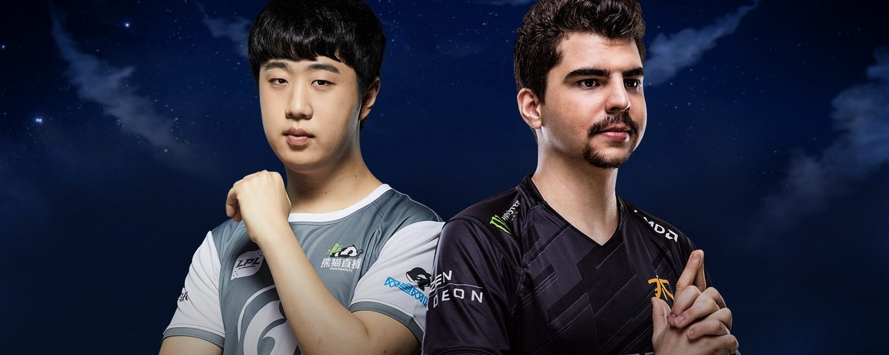
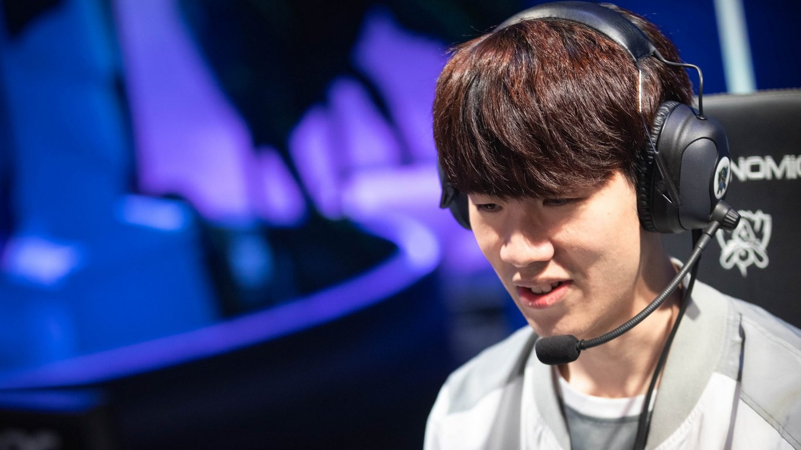
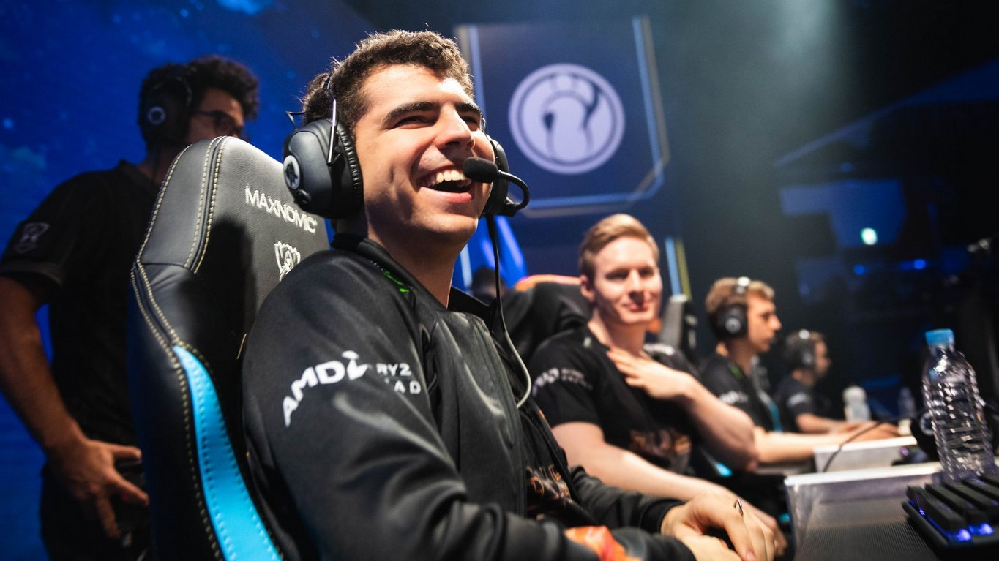
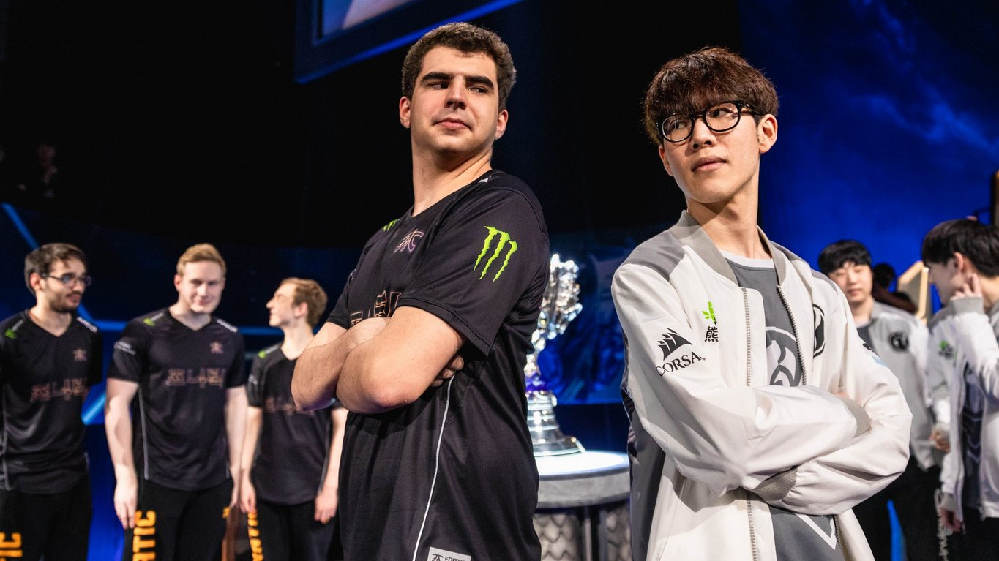

<!-- markdownlint-disable MD033 -->

#NOT WHICH, WHEN: THE FNATIC AND IG TOP LANE QUESTION

The top lane sub rotation for Fnatic and Invictus Gaming has eerie similarities.

Both teams use a younger player in a carry-oriented meta or that both teams have an experienced top laner who has seen years of international competition. But even more bizarrely, both teams had hardly subbed in their second top laner until a hand injury right before Spring Playoffs, preventing either team from running their most comfortable lineup against intimidating domestic competition.

That level of eerie similarity.

Of course, for the purpose of the World Championship, the relevant level of extreme coincidence only extends so far as prompting the question: which top laner should start in the most prestigious Best of 5 of the year?

Both Fnatic and Invictus Gaming began the 2018 season with two top laners on their rosters. For Fnatic, Gabriël "Bwipo" Rau joined Fnatic as a substitute in January of 2018, and for the majority of the 2018, it appeared that that’s exactly the position he would keep.

On the 28th of March, just days before the Semifinals against Team Vitality, Fnatic’s usual starting top laner Paul “sOAZ” Boyer surprised his fans with the news that he would not be able to play for Europe’s dominant team during Playoffs.

Though Fnatic looked unstoppable, analysts hesitated to predict clean sweeps. But through both the Spring Semifinals and Grand Final, Fnatic only lost one game before qualifying for the Mid-Season Invitational.

Bwipo showed definite hints of green behind his ears both domestically and internationally when he took over sOAZ’s position. Most of Bwipo’s picks like Sion or Ornn could absorb pressure and allow the jungler to divert attention elsewhere, but it seemed as if he struggled against the jungle pressure of the opposing team if Mads “Broxah” Brock-Pedersen didn’t hover near his lane. Fnatic snuck into the Playoffs of MSI, but didn’t win a single game in the bracket.

In the LPL, after qualifying directly for the Semifinals and only dropping a single Best of 3 series of 19, Invictus Gaming experienced a similar disaster. Both Lee “Duke” Ho-seong and Kang “TheShy” Seung-lok joined Invictus Gaming for the 2017 season, but iG showed definite favoritism for the younger player. The team came alive in the 2017 Summer split when TheShy took to the stage. iG’s team of young players dove past Inhibitor turrets before 15 minutes, and the team hardly looked back at their ex-World Champion top laner.

During the Spring Split of 2018, Duke only started in eight games of 42. iG favored their ability to dominate three lanes with TheShy, and their position representing China at MSI seemed all but finalized.

Just before the conclusion of the Spring Split, TheShy, like sOAZ, suffered an injury. Duke would have to return to the starting roster of Invictus Gaming for the duration of the Split.

To his credit, Duke performed well in his matches against Royal Never Give Up and Rogue Warrior in the LPL Spring Playoffs. Unfortunately for iG, however, a five game Semifinals where Royal Never Give Up boldly attacked iG’s mid-jungle duo meant iG’s regular season triumph would have a disappointing ending. RNG made their way to Berlin and won China’s second ever MSI Championship while Duke, TheShy, and the rest of iG watched at home.

For both Fnatic and Invictus Gaming, there’s an argument to be made for Spring injuries breeding short-term loss. But introducing Bwipo and Duke into the dynamics of Fnatic and iG after sOAZ and TheShy dominated Spring could have just as easily contributed to long-term gain.

Both Bwipo and Duke saw far more play time in the 2018 Summer Split. Bwipo played for Fnatic in two different roles, subbing in for both sOAZ and Martin “Rekkles” Larsson as time required. Playing for the team in the same games as sOAZ made distinctions between the two players more prominent. sOAZ always had the creative edge brought on by experience. He looked for more opportunities to influence the mid lane matchup, understood when best to Teleport, and knew when to prepare his top wave for a gank or an escape.

Bwipo began adopting a far more aggressive identity as a mage player for Fnatic on the bottom side of the map. He could adjust his positioning to account for a variety of styles of play, holding the edge of a skillshot and becoming familiar with a massive selection of picks, including some of Rekkles’ AD carry pool.

Duke tempered some of Invictus Gaming’s struggles by closing out matches. Fans of the 2016 SK Telecom T1 roster no doubt remember the stubbornly split-pushing Duke, but the Invictus Gaming Duke could take advantage of his team’s skirmishes or Yu “JackeyLove” Wen-bo’s catches in the jungle on Varus to initiate an engage. Both players favored carries, but Duke and TheShy divided duties between Aatrox and Aatrox counters or Gangplank and heavy turret-chippers like Camille. Duke will close a game, but TheShy’s wildness could carry iG to a point where they had so many second chances that one or two Baron throws seemed irrelevant.

At this World Championship, with a top lane meta varying considerably during Playoffs in every region, top lane rotations seemed — for once — like the most potentially valuable. Sion and Ornn occupied a lot of Playoff tape before the World Championship, but Aatrox, Urgot, and Camille made split-pushing fashionable. Only teams that could cover all bases would survive.

Eight of the sixteen teams that qualified for the World Championship main stage brought a substitute jungler. Six brought a substitute top laner, but only two made use of the rotation throughout the event, and both teams qualified for the Grand Final.

Fnatic’s and Invictus Gaming’s rosters had the ability to cover almost any surprise the World Championship top lane meta could have thrown at them. The tournament started favoring the likes of Sion and Ornn, which iG and Fnatic’s top laners could excel playing, but a year of flexing sOAZ and Bwipo, Duke and TheShy gave Fnatic the ability to draw on mages like Viktor or Swain and iG the opportunity to add champions like Fiora or Jayce to a list of Aatrox counters.

When discussing which top laner should start for Fnatic or Invictus Gaming, analysis often focuses too much on a false black and white assumption. sOAZ and Duke play tanks, Bwipo and TheShy play carries. Duke’s Ryze, Aatrox, and Irelia picks at Worlds paired with sOAZ’s history of a wide champion pool and being able to learn new champions quickly suggest that it isn’t quite that simple. It isn’t about having sOAZ absorb TheShy’s pressure or vice versa.

It’s about the resourcefulness that top lane provides both Fnatic and Invictus Gaming. In the match against KT Rolster, after a difficult loss playing with a split-pushing Fiora that came down to difficult late game decision-making, iG subbed out TheShy for Duke in Game Four. TheShy reset for Game Five to close the series for his team. In the LPL Playoff Grand Final, iG used a similar mechanism starting with TheShy and bringing in Duke for a reset in Game Two that allowed iG to come back and win Game Three for a close series.

Fnatic haven’t used sOAZ as a similar mental reset, but against Invictus Gaming in Fnatic’s single Group Stage loss, sOAZ had the best performance on his team, and his unique creativity and resourcefulness shone through. His engages on Sion corralled Invictus Gaming in the Baron pit and nearly provided an opportunity for a comeback.

Rather than making top vs top about playing tanks into carries or assessing skills in matchups, it seems more prudent for both teams to start with the young stars who have given them the most success so far this World Championship. In what promises to be a close series, both Fnatic and Invictus Gaming will be tested to adapt between games. sOAZ and Duke can both be part of that adaptation if Fnatic decide they need the right Teleport to help free up bottom lane and allow Zdravets "Hylissang" Iliev Galabov to roam, or if iG decide they need a game for TheShy to reset his mentality to give the team the best chance of winning two games after an initial loss.

That both Invictus Gaming and Fnatic are the only teams to come to Worlds with a rotating top lane roster in a volatile top lane meta is no coincidence. Both teams turned unexpected injuries and benchings into strengths in Summer. The strengths of both Fnatic’s and Invictus Gaming’s rosters is flexibility.

The question isn’t which, it’s when. Expect Bwipo, sOAZ, TheShy, and Duke to all make appearances in the 2018 World Championship Grand Final.