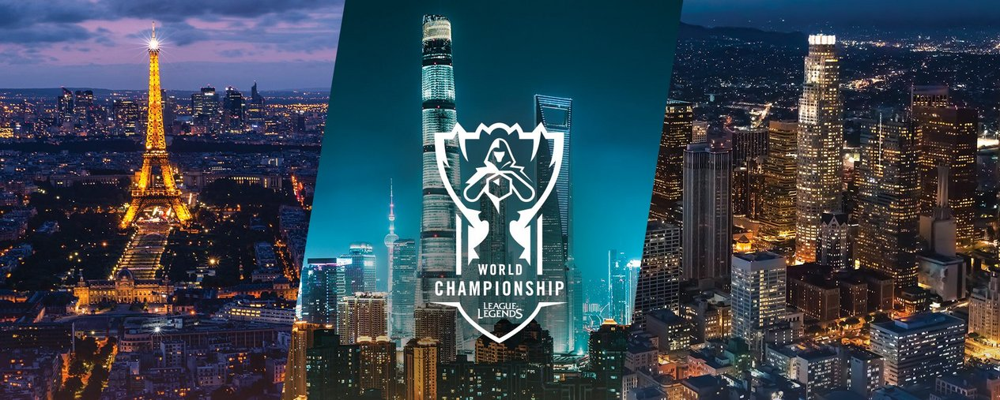
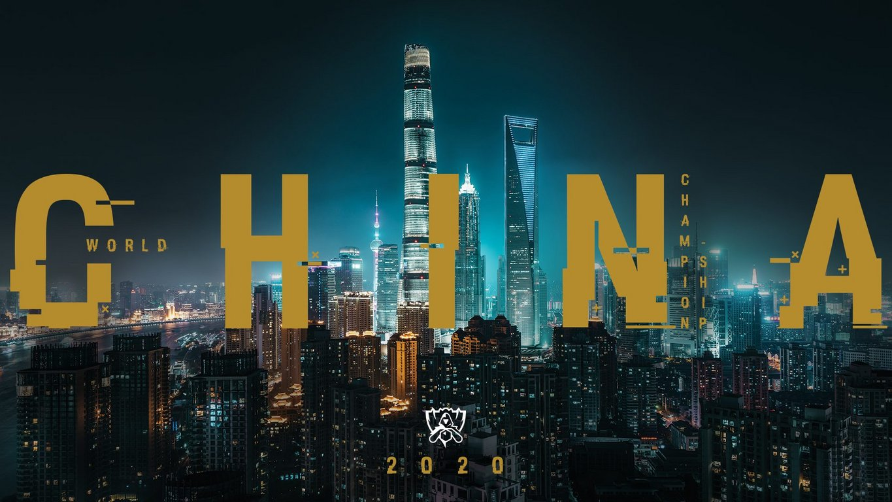
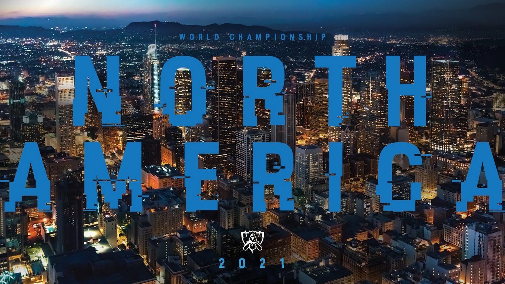

<!-- markdownlint-disable MD033 -->

#2019–2021 WORLD CHAMPIONSHIP HOST REGIONS

We want to ensure that our event experiences are among the best in sports. By creating more lead time for our major global event planning cycles, we will provide fans, players, teams, and partners with more time to plan ahead as well. We believe that this an important step that will help unlock more value for everyone that participates in our events around the world. Our 2019–2021 roadmap sees us returning to the homes of several of our most competitive leagues.

 
##WORLDS 2019: EUROPE

Next year, Worlds will return to Europe, four years after the last Europe-based Worlds concluded in Berlin, Germany. While information on stage-by-stage host cities and other details are forthcoming, the 2019 World Championship Finals will take place in the City of Lights: Paris, France at the AccorHotels Arena. Look for more news from our European league regarding long-term partnerships and more in early November. 

 

   

##WORLDS 2020: CHINA

During the 2017 World Championship in China, we reached new viewership milestones rivaling those of major traditional sporting events. More than 80 million viewers tuned in for Semifinals, and a crowd of over 40,000 fans packed a sold-out Beijing National Stadium (Bird’s Nest) at Finals.

We hope to follow that success at Worlds 2020, which will be a banner year for League of Legends esports as we bring our 10th World Championship to one of our largest and most passionate fan bases.

   

##WORLDS 2021: NORTH AMERICA

North America has played host to three of our past eight World Championships. As the North American LCS continues to grow and develop alongside team partners, we’re excited to return to the region in 2021.

For fans living outside of these regions, we look forward to sharing news regarding some of the new countries that we’ll be visiting with global events—such as the Mid-Season Invitational and the All-Star Event—in the future!   