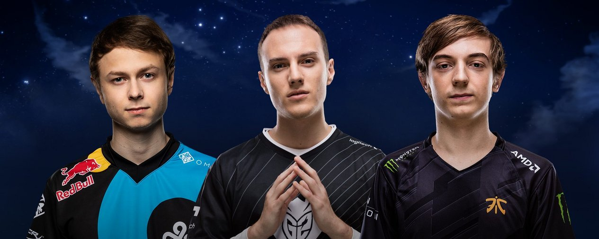
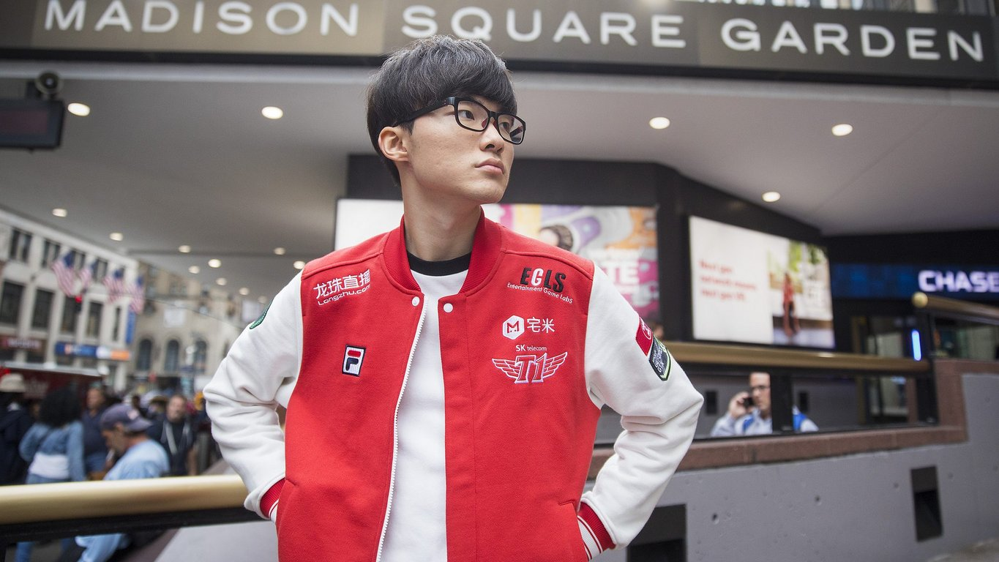
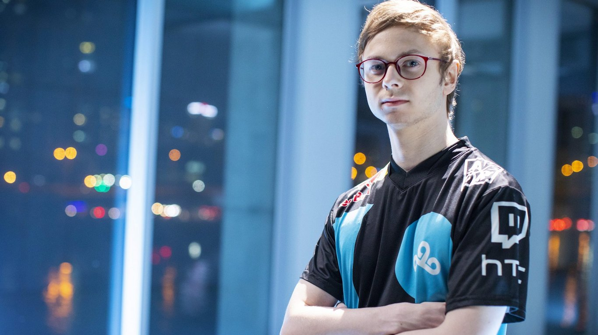
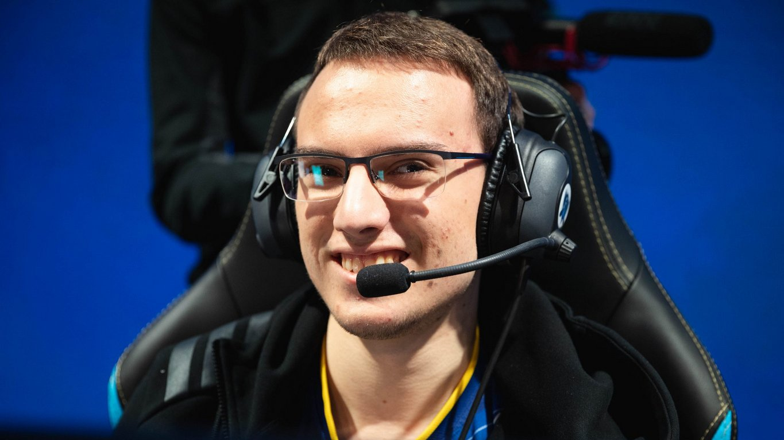

<!-- markdownlint-disable MD033 -->

#THREE GENERATIONS OF EU MIDS

At the dawn of competitive League of Legends, Europe began as the region of mid laners. Henrik “Froggen” Hansen, Alexey "Alex Ich" Ichetovkin, and Enrique "xPeke" Cedeño Martínez made the largest names for themselves in 2012 when international competition frothed to the point of boiling over. Even if a strong reputation for Korean top and jungle talent and Chinese ADCs emerged, even when Hong "MadLife" Min-gi began to change the way the world considered the support role, Europe had the best mids.

Froggen, Alex Ich, and xPeke all lead their teams to dizzying international heights at major tournaments during the second season. Both CLG EU and Moscow 5 went into the Season 2 World Championship as potential favorites to win it all. Korean team Azubu Frost also earned a mention, but commentators weren’t asking whether or not Froggen or Alex Ich could stand up to Jung “RapidStar” Min-sung of Azubu Frost, they were asking “Which EU mid is the best mid in the world?”

In 2013, the emergence of Lee “Faker” Sang-hyeok changed everything. SKT Telecom T1 K’s near unquestionable domination of the 2013 World Championship left no lingering dispute. Faker was the best mid laner and the best player to ever touch League of Legends, and he remained on top for years to come.

Faker changed everything — until this year, when SKT not only didn’t make the World Championship, they didn’t make the playoffs in LCK, and the LCK representatives who advanced to Worlds in place of SKT didn’t even advance past the Quarterfinals. Suddenly the flood gates opened, and the title of “best player” was no longer region-locked. Three mids originally hailing from Europe have risen to share the top of the conversation yet again.

In the era of Faker’s dominance, a general assumption that he represented not just SKT, but all of Korea, seemed to prevail. It wasn’t just one man, Korea had the absolute best mid laners available. A careful glance over history and the mid laners who emerged in this year’s Semifinals demonstrates that just because Faker was the best, doesn’t mean that Korea produced the largest pool of competitive mid lane talent.

In 2018’s World Championship Semifinals, representatives from three different generations of European mid lane talent took to Summoner’s Rift. Nicolaj “Jensen” Jensen, Luka “Perkz” Perković, and Rasmus “Caps” Winther all demonstrated that European mids have always found a way to rise to the top.

Jensen’s history is a complicated one, as his development draws from multiple years without an LCS debut. When the reign of xPeke, Froggen, and Alex Ich as the undisputable mid kings of the rift began to wane, other challengers from Europe emerged. Erlend “Nukeduck” Våtevik Holm of Sinners Never Sleep — later, Lemondogs — Søren "Bjergsen" Bjerg of Copenhagen Wolves, and another player known then as Incarnati0n were all members of the next generation of European mid laners.

Nukeduck and Incarnati0n in particular often met in solo queue and rose as prominent players of some of the best assassin champions. All three of Nukeduck, Bjergsen, and Incarnati0n have survived to play LCS to this day, but Incarnati0n couldn’t debut in the same year as Nukeduck and Bjergsen. Time stalled for Incarnati0n due to a competitive ban from February of 2013 until May of 2015. Such was Incarnati0n’s repute, however, that only days after his ban was lifted, he joined Cloud9, replacing legendary shotcaller Hai “Hai” Du Lam and taking on the name "Jensen".

Jensen’s beginning came as a struggle. He learned a great deal about side laning from Hai who returned to the jungle position in one of Cloud9’s now typical comebacks from the bottom of the standings to the World Championship. Nevertheless, Jensen had a chance to put his skills on display internationally for the first time in 2015: the only year in which C9 failed to advance beyond the Group Stage.

But even in this first modest performance, Jensen faced competent mid lane competition and didn’t falter. He had to test his mettle against Fnatic’s Fabian “Febiven” Diepstraten — a European mid who often looked up to Nukeduck and came out of the generation after Jensen’s — Rookie, and ahq e-Sport’s Liu "Westdoor" Shu-wei (famed more for his map play than laning prowess, but noteworthy on Fizz and Twisted Fate). Cloud9 split even with every team in their group, but lost the tie-breaker to ahq and failed to advance to the Quarterfinals.

Since 2015, Jensen had the opportunity test his skills twice against Faker himself. Cloud9’s record against Faker’s SKT stands at 0-4, but Jensen has made an impressive mark against nearly every other mid lane opponent he faced. In 2016, no mid but Faker could squash Jensen’s laning prowess, even Lee “Crown” Min-ho and Huang “Maple” Yi-tang. In 2017, he stood above a less tempered Lee “Scout” Ye-chan and got his revenge against Westdoor before a bloody best-of-five against Su “xiye” Han-wei.

This year, after a shaky Play-In, Jensen continued to perform exceptionally in Group Stage against Crown and Li “Xiaohu” Yuan-hao, only struggling against the Italian Stallion Daniele "Jiizuke" di Mauro. He exploded in their first game against Afreeca Freecs’ Lee “Kuro” Seo-haeng, leading Cloud9 to advance handily in the only 3-0 of the Quarterfinals.

Much of Jensen’s progress has stemmed from transferring his raw skill as the 1v1 monster that was Incarnati0n to a stable and consistent player who understands fake pressure and playing for his jungler. Jensen’s largest growth point this year came from his ability to roam if he took advantage of the window where he got first back against his opponent. He assisted both his junglers in Cloud9, adapting to the more unpredictable nature of Robert “Blaber” Huang and opening up options for Dennis "Svenskeren" Johnsen. Either way, Jensen looks best when he plays aggressively and opens an opportunity for his jungler to cleanup and snowball ahead, extending advantages to other lanes.

Flexibility makes the once young Generation Two mid laner look like the most mature of the EU mids in the Semifinals, but the accolade of best performer undoubtedly goes to Perkz: the middle child.

Jensen transcends a large swathe of mid lane talent following the reign of the original Top Three. He started in the era of Nukeduck and Bjergsen’s emergence and came to prominence during Febiven’s rise in 2015. Perkz, G2 Esports’ franchise player, comes from the generation of European mids after Jensen, Nukeduck, and Febiven — after Faker’s clout had irreversibly changed the landscape. He didn’t come up in a time where it was assumed he would simply wrest the mantel from Froggen or Alex Ich.

Perkz didn’t inherit anything. He had to earn it.

Anyone playing outside Champions Korea had assumed inferiority and had to prove they even had a shot at tangling with the best. While many European mid lane talents still received praise, it was with an air of uncertainty. They didn’t have the opportunity to spend the year playing against Faker, so how could anyone truly call them the best?

The likes of Heo “PawN” Won-seok, Shin “Coco” Jin-yeong, and Kuro often received accolades just by existing in the same league as Faker even before international showings. Despite strong individual performances by the likes of Alex Ich, Froggen, Xpeke, Febiven, Jensen, and arguably Bjergsen, European mid laners didn’t receive the same benefit of the doubt awarded to the Season 2 greats.

At his first international event, Perkz created ripples of outrage by suggesting that European mids could even be considered equals to mids hailing from any Asian region. The short memory of the international community allowed for the collective raising of eyebrows, and Perkz’s initial international showings, did him no favors.

Far from emerging as a bold and fresh rookie to take on some of the best in his role like Nukeduck, Jensen, or Febiven before him, Perkz’s first MSI yielded a 2-8 bowing out, and he crumbled even against Counter-Logic Gaming’s much-maligned Choi "huhi" Jae-hyun at Worlds in 2016. Some of Perkz’s most vocal detractors invented rhymes to celebrate his failures.

But regardless of where Perkz’s failings stemmed, his climbing of the global ladder redeemed him by the end of 2017’s MSI. Because of continuous competition at MSIs and the 2017 IEM World Championship, one could almost call G2 Esports and Flash Wolves unofficial international rivals. While Jensen found himself constantly pitted against ahq’s Westdoor, Perkz in particular has expressed that the LMS’ king of the mid lane has taught him a great deal.