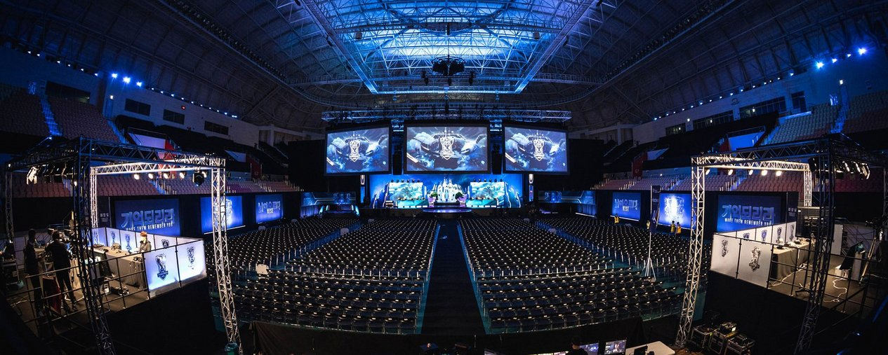
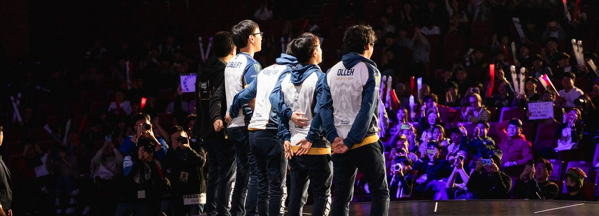
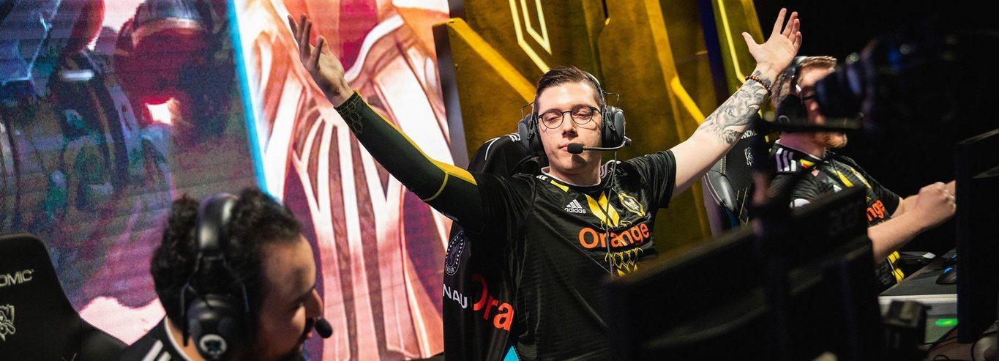
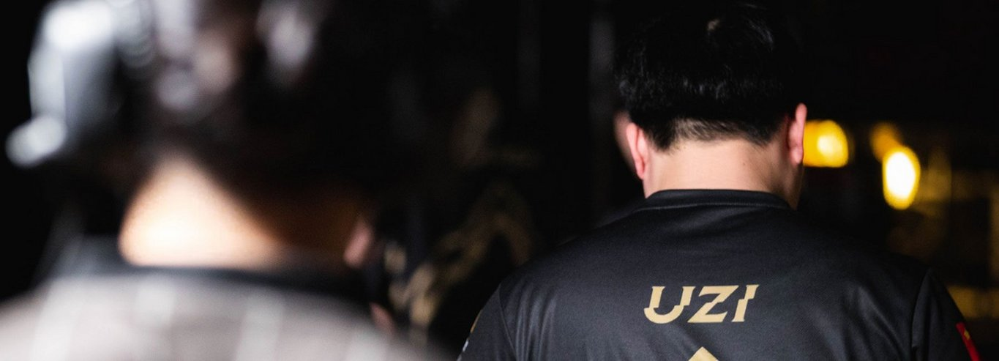

<!-- markdownlint-disable MD033 -->

#EIGHT VIEWS OF WORLDS 2018

##1. AGAIN & AGAIN
Here are some truths about World Championships in League of Legends:

One. The first was held at DreamHack Sweden in 2011. It was not in Phreak’s basement, but rather at the Elmia Exhibition and Convention Centre in Jonkoping. "Worlds" is a funny word for a tournament with only four regions, only two of which exist today in the same form, and "championship" is a funny title for a tournament that wasn't even the biggest on the scene. But it was still a Riot-organized tournament, and still we call it Worlds.

Two. There are only two players who were at Worlds 2011 who are still playing professionally. They are both at this year's Worlds. One of them is sOAZ. The other is Doublelift.

Three. In the eight years in which Riot has held a World Championship, an NA team has yet to bring home a title.

Four. Which means, of course, that for all eight years in which Doublelift has been playing professionally, he has never won Worlds.

When you are a fan of an NA LCS team at Worlds, your journey is the five stages of grief, but backwards: first, acceptance that they will never win, and eventually, denial that this is all they will achieve. These steps are not stations along a subway line of emotions, but rather a cycle doubling back on itself each year. So we might believe that TSM would have made it out of Groups in 2016, only to make peace with the reality that they did not. We might believe that Cloud9 with their rookies would not make it out of Groups this year, only to be proven very, very wrong.

We might, for a little while, believe that Team Liquid can make it across the finish line, even when we know better.

TL played through Groups so timidly it was like they were holding their breaths, like this was all a dress rehearsal and they were waiting for a sign to tell them that the real Worlds had begun. And when that sign came, it was, of course, in the form of defeat: KT Rolster losing to Edward Gaming and leaving TL without a way to advance to Quarterfinals. Finally, they were set free. And finally, they won against EDG.

To be a fan is to be resurrected time and time again in faith. I think of that final TL match as a prayer, one that all NA LCS fans know well: see what we could have done, if we had been given just one more chance. You hear it as Doublelift takes his headset off, a small wry smile on his face as EDG's Nexus falls: we can be strong, as strong as anyone, stronger even. He gets up and hugs Olleh, sad and slow: so believe in us one more time, for one more game. The rest of the team envelops Doublelift, and he puts his arms around his teammates, and for a brief second they bow their heads.

##2. THE MOST BEAUTIFUL MOMENT IN LIFE
In 2012, the Taipei Assassins came in like a storm, sweeping the local Garena competition in multiple events before storming their way through Worlds. And, like a hundred-year storm, once they left, they never came back. They would never go on to achieve such great heights ever again. They didn't even make it back to Worlds in 2013. But for a moment, they were the best team in the world.

Hindsight loves to downplay the teams that have one brilliant moment only to disappear. It says TPA weren't really that good, they were dependent on the meta, look at how they were murdered by Moscow 5 at IEM a few months later. Or last year's Misfits, yeah sure they took SK Telecom to five games, but SKT was in historically poor form—did it mean anything at all?

And maybe all those things are true. But what is also true is how we felt at those moments. I can only imagine how it must have felt to see TPA on every local newspaper and TV channel after they returned victorious from Los Angeles in 2012, but I can tell you how it felt last year watching MSF play against SKT. I was on my honeymoon in Hong Kong, and we were in a hotel room so small it was basically just a bed. From the bathroom windows, you could almost see Lan Kwai Fong, a small cluster of noisy bars and clubs, the hottest night spot in Central. But the only thing that mattered to me that afternoon was ten young men playing a video game just a few hours train ride away in Guangzhou. The only thing I could think about was the possibility, however small, of MSF going the distance.

I never expected to feel that way again. And then Vitality played Gen.G on the first day of the Group Stage.

Later, we would all realize this Worlds belonged to the underdog and it was being the favorite that was dangerous. The mighty LCK would drop team by team. Gen.G was just the first. But when VIT took the stage to play against Gen.G for the first time, we didn't know that Gen.G would finish with a 1-5 record, that no LCK team would make it past Quarterfinals. G2 had beat Afreeca Freecs just two hours earlier, but they were the old kings of Europe. Maybe it was a fluke. Certainly no one expected VIT, with three players who at this time last year were still playing in promotions, to take down last year's World Champion.

VIT didn't turn out to be the next TPA. They didn't even make it as far as MSF, who at least got the chance to play in the Quarterfinals. But like the joyful, fist-pumping TPA that won the hearts of the world in 2012, and like the 2017 "straight outta Challengers" MSF with the out-of-meta Leona pick, there was a moment when all the world's eyes were on VIT. It felt like Jiizuke on Ekko, juking and dodging and stunning up Cuvee in the Gen.G base, had shattered this timeline. Untargetable, invulnerable, he made the world all his own, and we had front-row seats to watch it happen.

##3. INTO THE NEW WORLD
Nature abhors a vacuum. So, too, do esport narratives. Without SKT this year, we grabbed onto the next best thing, and that was and may always be Uzi. Uzi could be a world champion if not for SKT's royal road. Uzi could be the most talented and most famous player to have ever touched League of Legends if not for Faker. Uzi the second place finisher. Uzi the uncrowned king.

2018 was supposed to finally be Uzi's year: he captured the spring and summer split titles, MSI, and even a win for China at the Asia Games. He was supposed to usher in a new generation of LPL dominance. And that may happen -- but not by him. Never mind that RNG didn't stomp through Group B the way we expected, dropping games to VIT and C9. Never mind that Uzi even during the first day of groups talked about being nervous with all the pressure of being the "final boss."

Why are we so eager to find the next dynasty? Maybe this was the original sin of SKT, who made us believe in dominance that may never again be replicated. We don’t want our winners to be merely strong or merely better at the game than their opponent. We expect all our winning teams to be superhuman gods descending from the Mount Olympus of League of Legends. Was Uzi always meant to be a demigod felled by his hubris? Or is it that after three years of SKT, this was the only way we knew how to tell a hero's journey?

A part of me mourns for the future that RNG had promised: a new dynasty with Uzi sat upon the throne. But if RNG gave us anything with their defeat, it was a chance at something new. When they fell to G2, they ushered us into a world with no gods, no kings, and no favorites. A new world full of uncertainty -- open for anyone's taking.

##4. BECAUSE OF YOU
On the blue side, we have Afreeca Freecs. In 2018, they booted their top laner for a 19-year-old nobody from Challengers Korea, added four players (mostly rookies), almost won the Spring Split, and finally made it to Worlds. No one knew when they entered that they would be Korea's last hope or that they would lose to C9 to give Korea its worst finish ever at Worlds.

And on the red (or rather, sky blue) side, we have Cloud9. In 2018, they booted both of their top laners for a 21-year-old nobody from the Challengers Series, added four players from their academy team, and climbed from tenth place to winning the gauntlet. It was a joke everyone liked to tell—that C9 was the NA LCS' only hope. It wasn’t until they beat AFS, giving North America its best finish in the entire history of Worlds, that we realized how true that joke really was.

The Korean sister team officially died in 2014, but its spirit lives on in fits and bursts in NA and Korea both. AFS coach iloveoov has been talking about it as far back as March 2017, telling Inven that he wanted "a constant and repetitive practice with double squads, consisting of at least 10 players and 3 or 4 backups for each team." And though C9 was more of a seven-man squad with subs in the jungle and mid lane, Jack Etienne as late as September told ESPN's Emily Rand that the players "really saw themselves as a 10-man squad." The academy team was an integral part of C9—a place where players could "reset and come back stronger."

You know that old adage about how it takes a village to raise a child. Though only five men from AFS and C9 were on the stage at any one time, each time they were carrying the hopes and dreams of many more. After AFS won against Kingzone in the LCK Regional Playoffs, its three coaches and five subs came flooding into the booth. Spirit and Mowgli embraced, while Aiming contentedly planted himself in TusiN's lap. I thought of it when C9 won against AFS in Quarterfinals more than two months later. It wasn't quite thirteen people, but there in the huddle were Goldenglue and Blaber, the latter rocking a backwards C9 snapback. They couldn't go with the others across the stage to shake hands, but Goldenglue held onto Svenskeren for as long as he could. Rubbed his shoulders, grinning, as if to say I've got your back.