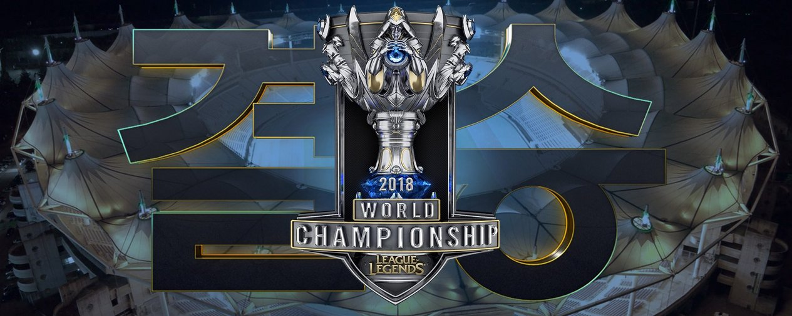
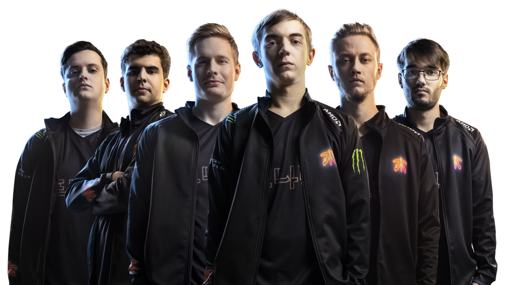
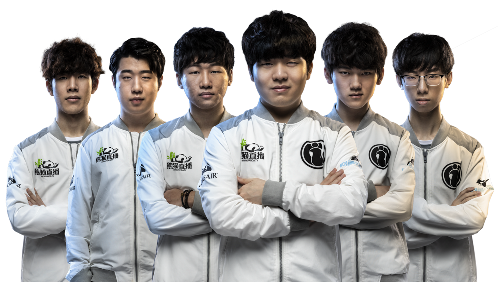
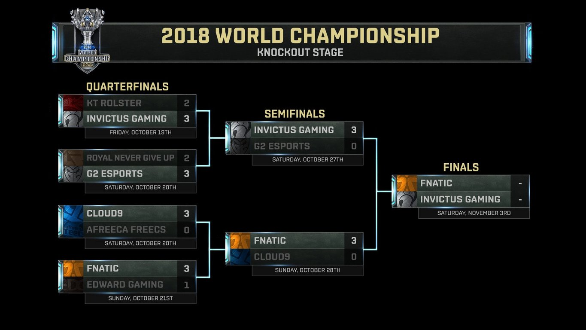

<!-- markdownlint-disable MD033 -->

#WORLDS 2018: FINALS GUIDE

It all comes down to this - here’s everything you need to know about the Worlds 2018 Finals.

The 24 best teams in the world have been narrowed down to two. On November 3rd at 8:30 AM CET, Fnatic and Invictus Gaming will fight for the Summoner’s Cup at Munhak Stadium in Incheon, South Korea.

The League of Legends World Championship Finals is the pinnacle of competitive play across 14 regional leagues. Winning Worlds is the greatest achievement in League of Legends, and the victors can indisputably call themselves the best in the world.

Finals will be streamed live at watch.lolesports.com. You can also catch a rebroadcast or spoiler-free VOD at watch.lolesports.com/vods the next day.

##WHAT’S THE FORMAT?
As with Quarterfinals and Semifinals, Finals will be played in a Best of 5 format. The first team to win 3 matches will be crowned the 2018 World Champions.

The two competing teams are:

##FNATIC

##INVICTUS GAMING

##HOW DID THESE TEAMS MAKE IT TO FINALS?

Reaching Finals required staying alive through four waves of competition over the past month - the Play-In Stage, Group Stage, Quarterfinals and Semifinals. FNC and IG have transcended their regional leagues, defeated the best of the best from around the world and taken their place at the precipice of victory.

Need a little more context? Check out the Knockout Stage results:

##SCHEDULE
8:30 AM CET: Opening Ceremony

We’ll kick off the show with the Finals Opening Ceremony presented by Mastercard. It’s set to be our biggest yet, and there are some huge surprises in store.

The ceremony will include a performance of the 2018 Worlds anthem ‘RISE’ featuring:
