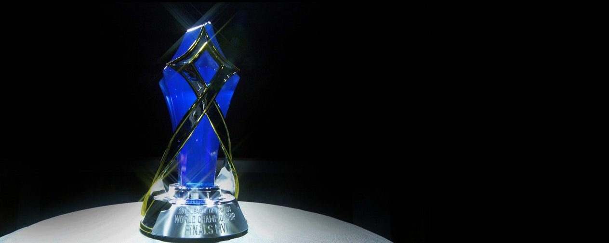
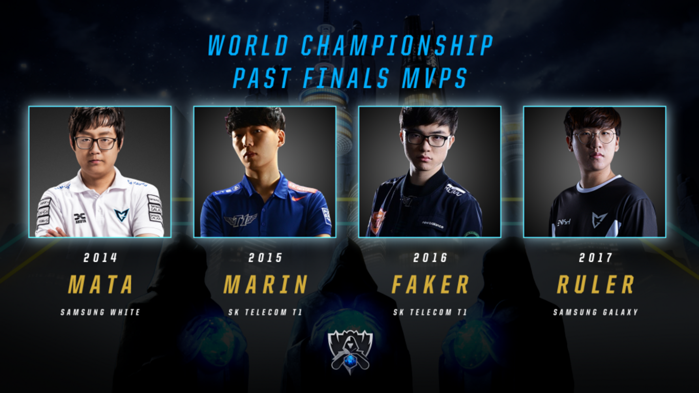

<!-- markdownlint-disable MD033 -->

#THE 2018 FINALS MVP AWARD

This year we are taking additional steps to recognize what being named MVP at the World Championship means and how the winner will be selected. The MVP award recognizes the individual who made the largest contribution to their team’s victory at the World Championship Finals. Past recipients include Mata (2014), Marin (2015), Faker (2016), & Ruler (2017).

For the 2018 World Championship, an international panel composed of pro players, team managers, media, and Riot Games casters & analysts will have a voice in the Finals MVP selection process. Prior to this year, the decision of who was named Finals MVP rested entirely on a small team of casters & analysts; expanding the voting panel to also include pro players, team managers, and media from the 14 regions better captures the diverse makeup of our community and the international nature of the World Championship.

To that effect the MVP trophy that will be presented at this year’s Finals has also undergone significant upgrades. The award features highly polished gold metal accents encapsulating a single shard of the blue nexus crystal. The design is evocative of the Summoner’s Cup and features the aesthetics of the World Championship. The goal was to create a symbol that this year’s best player would be proud to display for many years to come.

The 2018 MVP will be named immediately following the conclusion of the 2018 League of Legends World Championship. Don’t miss it - tune in for Finals November 3rd at 8:30 AM CET on watch.lolesports.com.