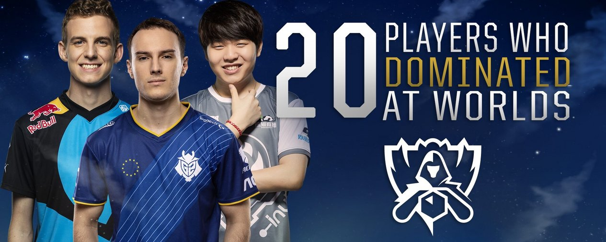
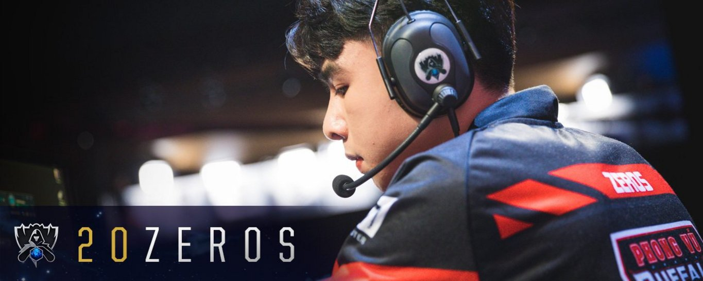
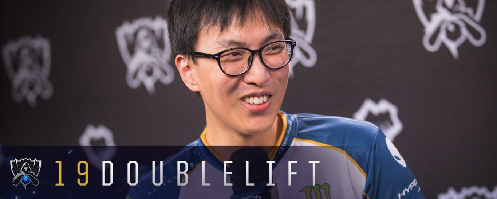
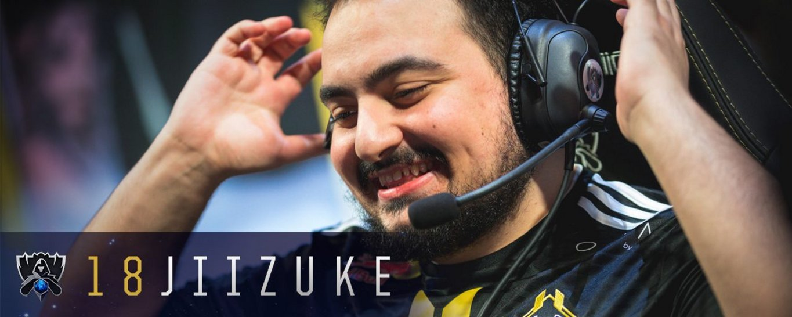

<!-- markdownlint-disable MD033 -->

#20 PLAYERS WHO DOMINATED AT WORLDS

Worlds didn't quite go as expected, so it's time to celebrate the players who made that happen.

You can’t be right all the time (or, in the case of the 2018 World championship, even occasionally), but covering competition isn’t about being right beforehand; it’s about celebrating success at the height of human ambition. After the dust of the Quarterfinals settled, it’s important to draw special attention to those who did exactly that.

Given the history of LCK’s performance at Worlds, seeing a semifinals with two European teams, one North American team, and one Chinese team requires major upsets — but also hero level showings. I wanted to kick off the semifinals by recognizing the key performers for every team that made a mark on this year’s main event.

To construct the top twenty list, I considered individual skill and clutch moments, map-based decision-making where applicable, consistency and importance of the player to his overall team success. Because of the final criteria, the top four of the list has a single representative from each semifinalist team. Play-In performances weren’t considered beyond adding context.

With the least amount of wins of any player on this list, Phong Vũ Buffalo’s Phạm “Zeros” Minh Lộc is probably the most controversial pick. But he put up impressive performances in laning phase against two of the best top laners in the tournament during Group Stage. PVB’s game against Flash Wolves features a highlight reel of Zeros’ work on Aatrox to even allow G2 Esports to play a tie-breaker. His pressure with jungler Hoàng “Meliodas” Tiến Nhật could have even meant the end of the road for G2 themselves. Every international event, a Vietnamese team sports at least one player whose name we can’t forget, and this Worlds, Zeros will linger in memory long after the victor hoists the Summoner’s Cup.

At this point, Yiliang "Doublelift" Peng's presence on Top Twenty lists is almost a joke. Every year he sneaks on, and every year, he leaves the tournament with expectations tempered. This year, more than any other year, his presence felt justified. Team Liquid’s problems stemmed from a deeper macro-based problem and poor dragon setups that didn’t allow Doublelift to get a good position in team fights. Even so, every win they came away with, Doublelift earned. His consistency, more than anything, gets him a spot on the list of top performers.

Any fan of Team Vitality would tell you that it’s almost offensive to blind pick Syndra against Daniele "Jiizuke" di Mauro. As an accomplished Ekko main, Jiizuke has spent his rookie year in the EU LCS outplaying his opponents in sidelanes and going for the daring catch that puts his team on the map. As always, an international stage never slows a European newbie down. In a meta where assassins become a viable option, and mid laners are one of the most important agents for a team, Jiizuke’s near complete and utter lack of a bad game speaks volumes.

 

 

