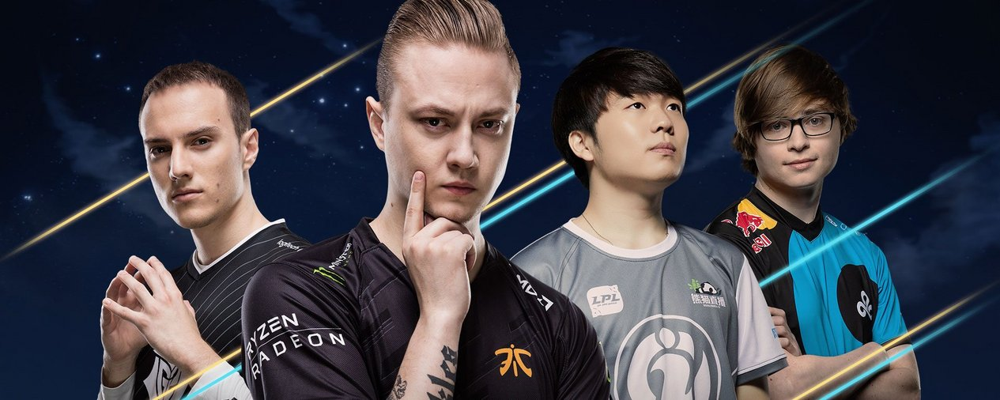
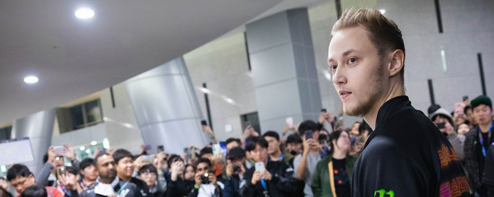
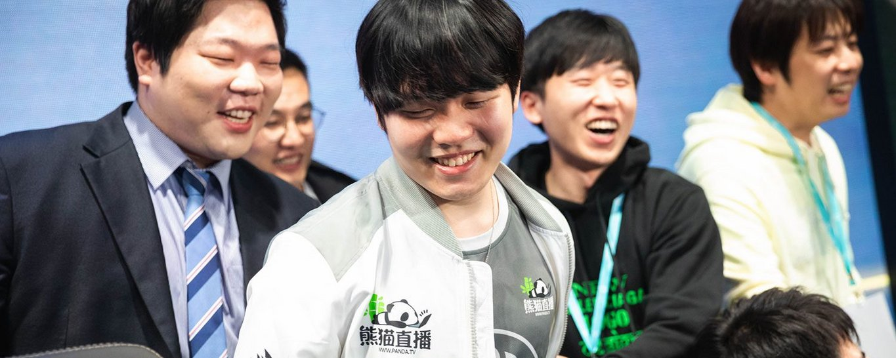
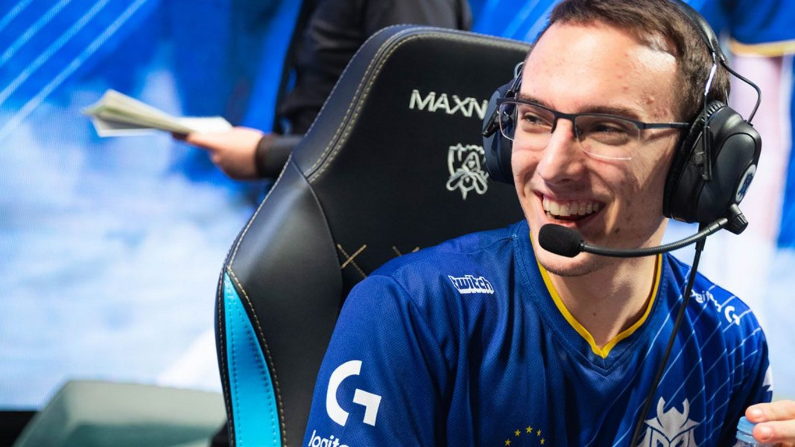

<!-- markdownlint-disable MD033 -->

#ALMOST WINNERS

In an interview with the Miami Herald, former Dolphins Quarterback and Hall of Famer Dan Marino said of his first and only Super Bowl, “I look back at it as I wish I was able to play in it again. Ironically, I was 23 years old and I felt for sure that I would be back. After the game, I was disappointed, down about the game. But I was like, ‘You know what, I’m going to be back and we’re going to win one of these. I’m going to be back more than once. Maybe twice, you never know.’ And it never happened. That’s the one thing that is the regret. It’s to not know what it feels like to walk off the last game of your career and know that you’re Super Bowl champs.”

That was Dan Marino’s second season -- he would go on to play 17 seasons and never make it again. League of Legends is fast approaching its eighth Worlds Semifinals, and among the starting cast of the remaining 20 players, only one has made it past this stage -- that’s Fnatic’s sOAZ, who did it in Season 1 when the event was drastically different. Other than him, this is Sneaky’s sixth attempt and first time making it this far. Rekkles is in fifth year and fourth attempt. Jensen and Svenskeren are at four, and Perkz is at three. No one else remaining has even made it more than twice, but some, like Rookie, have been playing for years.

What’s in front of them now is the greatest opportunity of their careers, and it’s one that they may never have again. After three straight years of Korea vs. Korea in the Finals, no Korean teams remain -- there’s no big boss looming at the end of the tunnel. Instead, all four of these teams are racing only each other to make it to the finish line. All of them realize that, too -- they look up and see new faces. And then they look even higher and see themselves.

No one can really say how long these players’ careers run. Maybe it’ll be longer even than Marino’s career, and maybe it ends immediately after Worlds concludes this year. They may or may not play in another Semifinals, and this moment may or may not wind up being the defining point in their careers. But all of them will remember it.

When I was 9, I lost my school Spelling Bee, and then I lost in the Regional Bee after that -- the two words I spelled wrong were spirited and silhouette. At 13, I tried out for the basketball team and missed the cut. At 21, I was the ace for my university’s Starcraft team. I lost the decisive match against a Terran player because I was too afraid to hit my two Hatch Roach timing. Each of those was a moment I failed when the pressure was on. The immediate rush after such a loss is like when you haven’t eaten for a long time, and you should be hungry, but you’re not. Instead you think about what you should have done instead. You paint the path that could have been in your head. That, to me -- your vision of what it could be like -- is regret.

Two of these teams will watch as the other two advance. Two of these teams will look back at this moment some day and wonder “what if?” They’ll think about a missed cannon minion or a missed skillshot or a bad rotation. A missed Smite or an unlucky crit. Here, on the biggest stage of their careers, two of these teams will learn that being so close to the top will only make them realize just how far away it truly is.

“WE WEREN’T READY yet to win Worlds [in 2015]. In particular, I wasn’t ready -- maybe the team was but I wasn’t ready,” says Rekkles. “I played against PraY in the Semifinals, and I felt like I didn't stand a chance. He was just running over me in those games. This time around, I’m just in a better place. I can deal with any player in the world and even though we might not be that much better as a team, just the fact that I can stand up on my own gives my team so many more chances to win the game and so many more angles we can attack from rather than ‘Huni needs to carry and if Huni doesn’t carry, then we have nothing else to offer.’

“My personal development is a big reason already as to why we have a big chance to win the whole thing, but at the same time I don’t want to take anything away from my teammates -- I have five teammates who can easily rival any of those 2015 guys and to find that within EU players only is something I personally find really spectacular.”

Rekkles is the face of the EU LCS and Fnatic is its premier team -- they’ve won more championships than every other single EU LCS team in history combined. They understand what it takes to win more than anyone else in Europe, but they’ve also been unable to replicate this at Worlds in the global era. In 2013 and 2015, they also made it to the Semifinals -- a third trip now cements them as the most successful Western franchise of all time, but like everyone else, they are still chasing the Summoner’s Cup.

That juxtaposition of domestic success versus international shortcomings has had its toll. In 2014, Rekkles left for a split (before returning) to join Team Elementz -- an unsuccessful “super team.” In 2016 they missed Worlds altogether, and then last year, after starting the Group Stage 0-3, he doubted his career trajectory more than ever. Even after FNC managed to make a miraculous rally to make it to the Quarterfinals, he thought about his options.

“I actually considered if I should go to NA like everyone else, or should I go to China if I can or Korea if I can because it didn’t feel that special to be part of Europe,” says Rekkles now. “But after seeing all of these big names leave in the past year and seeing how they can't get anything done over there, it made me realize how much more grateful I should be for what I have and I should just make use of the few years that I have left and actually get shit done.”

This year, of course, has been much different. Europe has spearheaded the identity shift that has swept Worlds off its feet. While Vitality will receive the bulk of the credit for what they accomplished in Group B, it’s Fnatic who has truly refined the idea of playing to your own strengths. Having won both splits of arguably the second most successful region in history, they are rightfully seen as the favorite to capture the Summoner’s Cup now. They know it, too.

This weekend is being billed as a bit of an LCS Super Bowl for Western supremacy -- the second most successful Western franchise of all-time is Cloud9 and their five Quarterfinal appearances. The two have even matched up twice before, with Fnatic winning in 2013 and then also escaping a group with C9 in it in 2015. Up until this point in the tournament, though, fans have been content to lean on each other as a singular “Western” mob, but that’s rubbed Rekkles wrong.

“I would really like to just refer to myself as a European, but I know the fans see it as the West vs the East. But I think after this year it will no longer be the case,” says Rekkles. “I personally really like it because I hate it when we see ourselves as one when we really never talk to each other. The only correlation we have is that they have some of our players over there. The fans make it seem like we’re best friends and we talk everyday, but that’s just not the case. I have no relationship with [most of] those guys at all. In my mind, they’re just as unfamiliar to me as Chinese or Korean teams.”

Which is perfectly fine for the NA vs. EU narrative frenzy -- there are no teams more fitting for a matchup of this magnitude than these two. Rekkles is super confident about the matchup -- he says he’s only worried about C9 potentially coming up with cheese strategies this week, but that he’ll train hard to be ready for anything they’ll throw at him.

“I think we played terribly against EDG and I think if we play terrible against C9, we will probably win anyway. I don’t have many worries for the Semifinals. We’re not going to repeat the mistakes we made against EDG and we’re going to go back to a similar performance to what we had in the second round robin of the group stages, and we’re going to sweep C9 and go into the Finals,” says Rekkles.

All that’s left now is to actually back it up. This has been an absolutely dominant year for Fnatic, and winning now would permanently etch their name into history. There are no caveats and no asterisks this time. Last year, their tournament ended with Rekkles frozen to his chair -- as if in a state of shock -- as he cried. The camera lingered on him, and as a fan you had to wonder if it was the last time we’d see him in Fnatic colors. But here he is, back in yellow, and I think this is a scene he couldn’t even begin to imagine when he was stuck in that chair last year.

and I think this is a scene he couldn’t even begin to imagine when he was stuck in that chair last year.

rookie
IT IS 2014 AND JUBILANT ROOKIE sways on stage with glitter in his eyes as his jungler, KaKAO, passes him the microphone. The KT Arrows have just won the LCK Summer Finals in 5 games over Samsung Blue. He declares, “We’re going to go all the way to the World Championship.” Hailed as “Faker Junior” and regarded as one of the best mid laners in the World -- you believed him in that moment. Swept up by a frenzy of emotion from the team and the crowd on a beach in Busan, you might have believed anything.

It’s even a moment that Rookie describes as still being “the most memorable” of his career. But of course we do know what happens after that -- KTA suffers a crushing defeat in the LCK Regional Qualifiers that year and fail to make Worlds. Rookie and KaKAO leave the team and transfer over to Invictus Gaming in China as part of the massive “Korean Exodus” of 2015. They reach Worlds that year and are, as fate would have it, placed into a group with Cloud9 and Fnatic. They finish last and are eliminated. That was the last time we saw Rookie on the Worlds stage -- otherwise there have been only murmurs of a dominant mid laner who can’t escape the grueling test that is the LPL.

“This Worlds is one I couldn’t have imagined happening,” says Rookie. He’s one of the more talkative players and is happy to give extended answers to questions.

He continues, “The KT Rolster I was on and now is extremely different -- they’re not the same team as when I was a player there. When I played against them, I didn’t think, ‘Hey this is my old team.’ It was more, ‘They are a strong team.’ [But] the fact that I was a former member did make me a little uncomfortable because I knocked them out. Compared to the Rookie of 2014 and now, I am a more perfect Rookie.”

While this iteration of IG has been highly regarded throughout the whole year, they’ve failed to come up big in the clutch. They were eliminated from the LPL Playoffs in both splits by Royal Never Give Up, and after the Quarterfinals Draw, it seemed like they might be destined to permanently live in RNG’s shadow this year. And even that opportunity would only be true if they could defeat Rookie’s old team, KT Rolster. Well, that narrative was upended entirely thanks to two massive upsets in the Quarterfinals. First, Rookie and IG beat KT in five, and then G2 did a favor for them by beating RNG in five -- suddenly for IG fans, you had to wonder if this Worlds was your lucky break after all those years of failure.  

The aftermath of that chaotic day leaves them as the last hope for China, but it also gives them a pretty good shot at taking the title for themselves instead of watching RNG lift a trophy again. Despite being one of the oldest teams in China, IG has never captured a single title -- this is by far the biggest moment in their history, and winning here can redeem everything for their fans. Rookie is a beloved figure in China now -- he’s fluent in Mandarin and has recorded himself singing Chinese songs and playing guitar for his fans. The fans are exactly who Rookie’s thinking of as he heads into this Semifinals.

“At first, [I wasn’t sure if] I deserved all this praise and love from these fans when we haven’t even gotten a single victory,” he says, “But right now -- I’m a devout Christian and through a lot of prayers, God told me this is my opportunity to show the world what I can do and make my fans proud. I want to show them this is who IG is. This is who Rookie is. And this is how far we’ve come.”

ON NOVEMBER 24, 2017, TSM announces that Zven and mithy are joining their roster, officially stripping G2 Esports one of the core components to their complete regional dominance over the EU LCS in 2016 and 2017. It is part of a massive overhaul in the offseason for the team, and the only certainty would be that they would rebuild around Perkz. He is a brash if at-times overconfident player who’s been loved and then memed to death by the community. He’s bounced back from all of his lows, though. And right now -- he looks like one of the best players in the world.

“I always think of myself as the best player in the world. When I played throughout the whole year, I know that I’m the best. It’s just the mindset that I have,” says Perkz.

There are a couple of ways to take a statement like this from him. First, you can say he’s just hyping himself up so that he can actually play like the best player in the world when the time comes. And to that I’d say you are wrong -- I think he actually believes it. And I think that’s great -- it’s something all the greats across any sport believe. This year he has a chance to actually prove it, too.

He does however caveat it with the fact that he doesn’t think lowly of other players -- he’s always trying to learn what he can from them, and he’s been very impressed by Rookie in their scrims. And while Rookie has had the highest CSD at 15 among all mid laners throughout the main event, Perkz is right behind him at second -- it’s going to be a really impressive clash of skill in the mid lane.

G2’s run has been surprising to say the least. They were swept out of the Quarterfinals in the EU LCS Summer Playoffs and then they had to win two Best-of-5s in the gauntlet to even make it here. They dropped one of their first Play-in matches against Supermassive, and then they dropped their first match of the main event to the Phong Vũ Buffalos. Over and over they’ve looked like they could be out for the count, but breaks here or there have kept them alive. And their own play as well has been inspiring -- a strong commitment to their solo laners’ ability to split push has resulted in them having one of the most distinct play styles we’ve seen in years.

This is a far cry from 2016 when the vacation memes about G2 was born -- they’ve steadily improved their international results ever since. Last year, they made it to the MSI Finals against SKT and then performed admirably in a very difficult group at Worlds.

The gravity of this moment isn’t lost on him -- he contextualizes how hard it is to win by reflecting on his MSI 2017 Finals run, “Back then, SKT was really, really, really good. It was crazy how people underestimated the importance of winning everything. It was just insane. You can’t even… right now it’s gone and it will probably never happen again -- that there’s going to be a team like that. It was just fucking crazy what that was. They won every single tournament.”

I thought this was really good insight from him -- I find that a lot of pros just kind of bury their head in the game and don’t spend that much time thinking about the history and legacy of the sport. So it was nice to see him reach a stage as grand as this and also have the ability to look at the greater scope of things to appreciate what greatness actually looks like here. Perhaps it’ll inspire him to rise to the level that SKT displayed over those years -- after all, he’s one of the few players to experience the form of a champion in their final moments before winning.

I think G2 is a pretty big underdog here, which is something Perkz says will just be to their advantage. They’ve been underdogs at every single stage of the main event so far, but that type of thing only affects the narrative around the event. Once you get on the rift, there’s no bonus points for being an underdog or a favorite. The better team wins. That’s it. And that’s been G2 when it counts so far this Worlds.

They’ve just played their game without worrying about perceptions. Perkz says, “Just stick to your shit -- it’s not something we’ve always done in the past. We tried to adapt too much. Even if we tried to stick to our stuff, we’d lose one game and give up completely. That was the worst thing ever that I learned. But now we are sticking to our stuff, and we’ll stick with it to the end. If we win, we win. And if we don’t, we don’t. That’s how it is. Play to your strengths.”

IG knows what that strength looks like at this point. They’ll have had a week to prepare for it. All that’s left is to see if those preparations are enough.