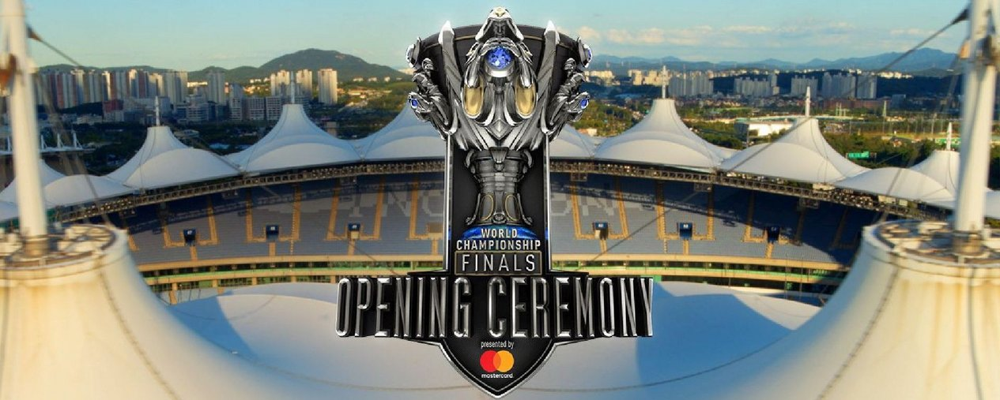
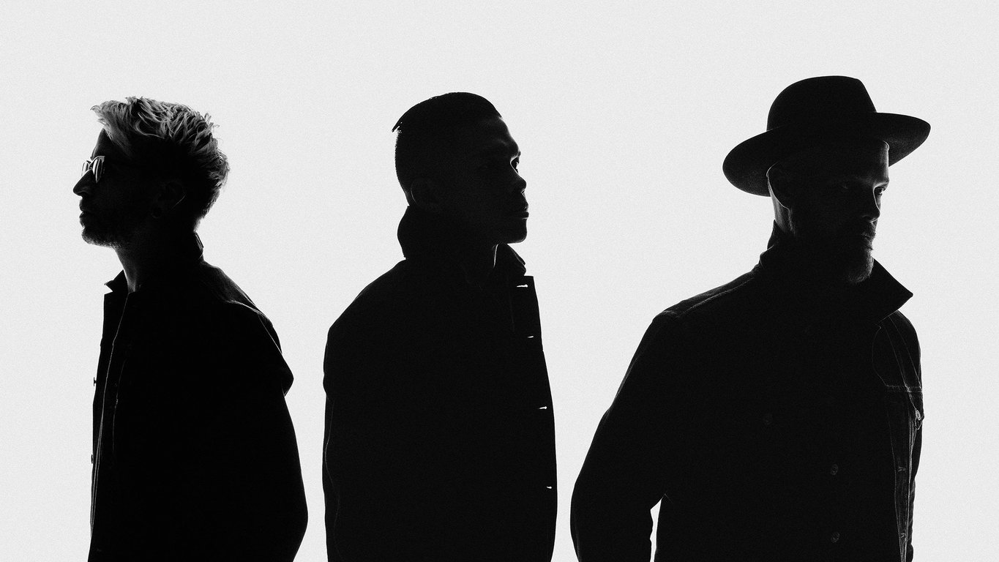

<!-- markdownlint-disable MD033 -->

#WORLD CHAMPIONSHIP FINALS OPENING CEREMONY

The 2018 World Championship Finals will kick off in Incheon, South Korea on November 3rd with the ‘Finals Opening Ceremony presented by Mastercard’ featuring musical performances by artists from both sides of the globe.

In addition to several surprises in store, the Opening Ceremony will include a performance of the 2018 Worlds anthem ‘RISE’ featuring:

##THE GLITCH MOB

##MAKO

This year’s ceremony will be unlike anything you’ve seen before, so be sure to tune in to watch.lolesports.com at 8:30 AM CET on November 3!