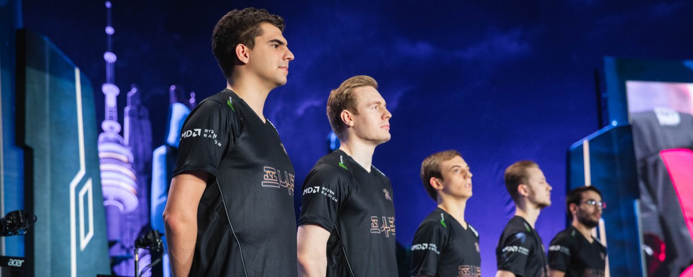
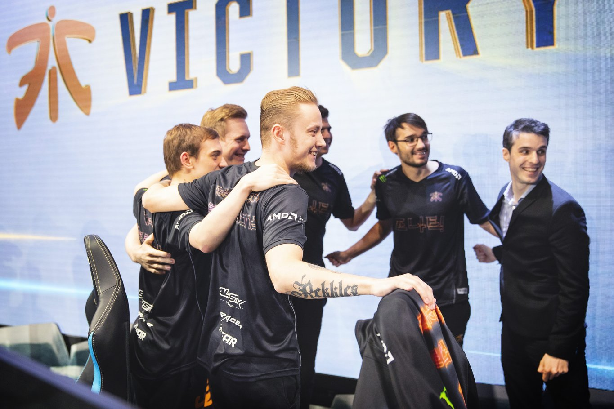
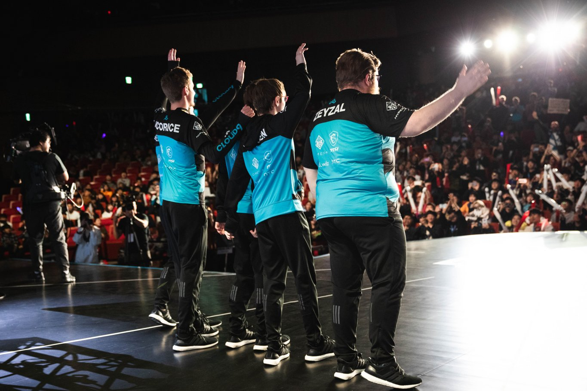
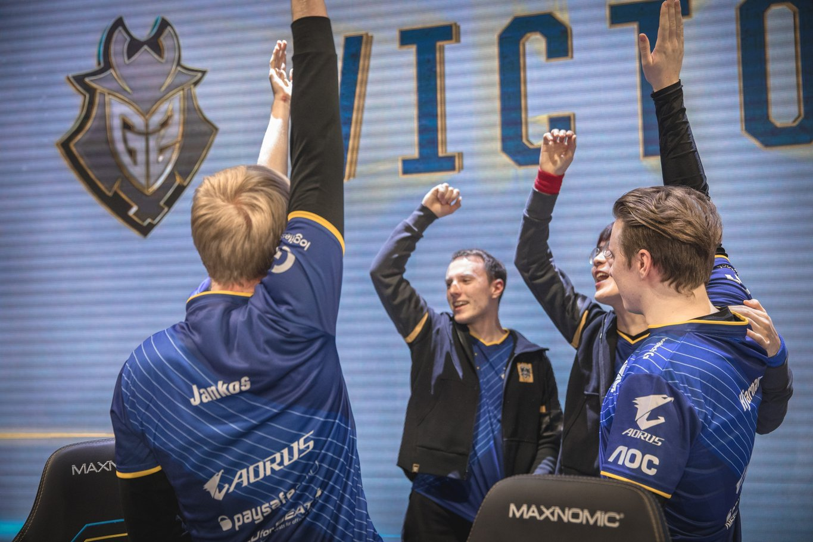

<!-- markdownlint-disable MD033 -->

#THE ROAD TO VICTORY: WHAT WILL IT TAKE TO SEE AN ALL-EU FINALS?

Two European teams have reached the Semifinals of Worlds for the first time since 2015, and Fnatic and G2 have a real chance of going all the way this year.

First, though, they have to overcome Cloud9 and Invictus Gaming. We look at five key challenges each EU team will face going into the Semifinals. 

##FNATIC

##1. OVERCOMING AMERICAN PLAYSTYLES
Cloud9 have been on a roll since Week 6 of the NA LCS Summer Split when they were desperately in need of some form. In Week 5, they were in 10th place but, since then, only a handful of teams have been able to take a game off them.

Fnatic will be favourites going into the match, but C9 look dangerous. Beating a Korean team is hard enough at the best of times. In fact, the last time a non-Korean team knocked out a Korean team was in 2014– but Cloud9 did just that by dispatching Afreeca Freecs in the Quarterfinals without a blemish: 3-0.

History is on Fnatic’s side, though. Fnatic have beaten Cloud9 in a Best of 3 at Worlds before, in the Quarterfinals in 2013. More recently, they tied at one game apiece in Group B at Worlds 2015; however, Cloud9 ended up not progressing to the Knockout rounds.

##2. CLOUD9’S JUNGLER, DENNIS "SVENSKEREN" JOHNSEN, IS IN FINE FORM
In Cloud9’s incredible victory over AFS, Dennis “Svenskeren” Johnsen took home the MVP vote for his role in the win. During the Quarterfinals, he had the second highest overall KDA with 9.3. He also notched 19 kills, third in the overall table behind Yu “JackeyLove” Wen-Bo (21) and Luka “Perkz” Perkovic (23)– but they played all five games. Svenskeren only played three.

Prior to the Quarterfinals, it looked like Xin Zhao was Svenskeren’s weakest champion thanks to his two losses. However, he turned that around against AFS by going 5/1/5. He even brought out a Graves and went 9/1/4.

##3. CLOUD9’S OUTLANDISH PLAYS ARE WORKING
In and out of game, C9 have been having the time of their lives. Down on gold in game three of their Quarterfinals match, Eric “Licorice” Ritchie and Nicolaj “Jensen” Jensen went in 2v5 against AFS in the Baron pit. Inconceivably, they took down the jungler and stole Baron as well.

Not many teams would even try for that play, and it’s something Fnatic need to watch out for. Ward up, keep your eyes peeled, and never take anything for granted.

##4. GETTING PAST JENSEN
Jensen has been putting his life on the line during Worlds 2018, but he’s been helping out his other lanes while doing it. He died 17 times during Groups, but managed a huge 80.6% kill participation stat.

Ryze was a priority pick for Jensen during the Group Stage but in the Quarterfinals he picked three different champions, so he’s tough to ban out. He’s undefeated on LeBlanc so far, and went 6/0/4 with her against AFS. Is it a risk to let him have it again? Or does Fnatic trust in their star mid laner, Rasmus “Caps” Winther, to outplay him?

##5. POCKET PICKS
Cloud9 should be smart enough to not allow Mads “Broxah” Brock-Pedersen play Lee Sin, who he has a 14.0 KDA on. EDG were even foolish enough to try and play Lee Sin against him. It did not go well.

He’s definitely Broxah’s pocket pick but, unfortunately for Cloud9, Broxah has two pockets. He’s played four games as Xin Zhao, won them all, and racked up a 13.3 KDA while doing so. He’s second in overall KDA at Worlds with 9.9.

##G2 ESPORTS

##1. INVINCIBLE INVICTUS?
Invictus Gaming never looked like they would struggle in Group D. However, crushing the hopes of Korea was a lot trickier and they had to battle and eventually beat KT Rolster 3-2 in the Quarterfinals.

Still, they’re in fine form. IG’s key player is Song “Rookie” Eui-jin, considered the best mid laner left in the tournament (although Caps might have something to say about that). G2 will need to do what they’ve been doing so far and use that 1-3-1 strategy to perfection if they want to overcome IG.

##2. EXPLOITING IG’S WEAK SPOTS
It came down to a 42 minute game five, a pretty long one in this Worlds meta, for IG to overcome KT. It could’ve gone either way, and G2 could have a very different opponent.

JackeyLove stubbornly stuck to Xayah for most of the Quarterfinals, but had a bad time when he was on Kai’Sa in game four. Just a blip after a good Group Stage with the champion? Or something for G2 to capitalise on?
