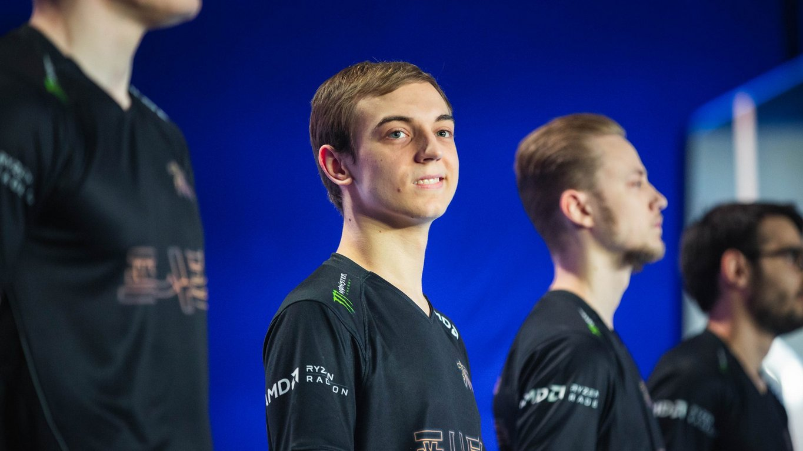

<!-- markdownlint-disable MD033 -->

#THE BEST MID DOES NOT MAKE THE BEST TEAM

“Every now and again,” Oceanic caster Jake “Spawn” Tiberi's easy cadence began at the conclusion of Fnatic’s Game Two win over EDward Gaming, “as commentators, we get to sit back and watch a star born on the international stage. And my god, Caps, what a bounceback performance!”

After EDward Gaming’s decimating Game One victory over Fnatic, Rasmus “Caps” Winther had his highlight performance of the entire four game series with stuns in crucial team fights, a 6/0/8 score line, and a redemption for the team’s first pick Irelia. This — yes, this moment — was what onlookers and fans of European mid lane talent had waited for from Fnatic.

Touted pre-Worlds as potentially the greatest European player to ever touch League of Legends, Caps had more of a spotlight and higher pressure on him in the west than arguably any player ever has. A quiet fervor whispered of the possibility of Fnatic’s rise. Between scrim rumors, Group Draw, and domestic dominance, their chance at a Grand Final appearance didn’t seem outlandish or insane.

Caps stood at the center of all of it, the sole European representative on the lolesports Top 20 list, all the way at Number Nine. If Fnatic made it past Groups, if Fnatic made it past Quarterfinals, it would be on Caps.

But Caps wasn’t the real story for Fnatic in their 3-1 Quarterfinal victory over EDward Gaming. In fact, Caps hasn’t been the real story for Fnatic all tournament.

Caps went from a startling five solo kill game against 100 Thieves to open Fnatic’s journey through the World Championship against Yoo “Ryu” Sang-wook, but as the European first seed played more games, he faded progressively more into the background. After Quarterfinals, Caps averages a -190 experience difference and a -304 gold difference to his lane opponent at 10 minutes.

Of course, Fnatic opted to blind pick Caps’ champion in nine of his eleven games relative to six of 12 games for the mid laner hailed as the best at the tournament, Song “Rookie” Eui-jin, but Caps has struggled more than he should, even in losing matchups. Lee “Scout” Ye-chan solo killed Caps twice in the series, surprising him with Syndra’s Q-E combo to start out their faceoff in the final game.

One shouldn’t say Caps played poorly. After all, key brush camps and catches onto Hu “iBoy” Xian-zhao proved pivotal in that same match. But Caps did not meet the standard set for him against the two mid laners from LPL teams he played against; the rest of his team did.

In the turn around Game Two against EDward Gaming, Mads "Broxah" Brock-Pedersen three-buffed the LPL team’s aggressive jungler Chen “Haro” Wen-lin while he looked for a pick on the top side of the map. His lead allowed Fnatic to contest bottom side vision, and though they didn’t secure the first Infernal Dragon of win out against EDG’s bottom side dives initially, Fnatic got control through mid lane off Zdravets "Hylissang" Iliev Galabov’s resets. When EDward Gaming tried to 3v3 the mid lane with jungler, support, and mid laner, Hylissang’s signature Braum turned an engage that set off Caps’ snowball.

When Fnatic play, they do so through mid lane, but that doesn’t mean they just play through Caps.

In a typical Fnatic game, the most important element for success is actually the bottom lane. Fnatic highly prioritize Braum for its ability to get priority in lane against popular support champions like Rakan and Alistar. Braum can turn engages or follow up dives. Early on in the year, Fnatic had a great deal of success with the Ezreal and Braum lane combination because of the extreme level one potential. The burst damage and crowd control from Mystic Shot and Winter’s Bite could win the game at any buff contest before minions even made their way to lane.

An early advantage for Fnatic’s bottom lane matters because it gives Hylissang the ability to initiate a back before an enemy support and make a play mid with an item advantage. It can also guarantee an early sightstone for bottom side river control. That makes it more likely for Hylissang to roam through river and assist Caps and Broxah undetected.

Most often, Fnatic get this bottom side control with the help of jungler Broxah, and look for a three-man play (sometimes four-man, depending upon the state of Paul “sOAZ” Boyer or Gabriël “Bwipo” Rau’s lane) for Caps. They attempt to chip away and secure the mid lane turret first, opening the jungle for Broxah to continue to have free reign.

In both the first game Fnatic played against Invictus Gaming and the first game they played against EDward Gaming, Fnatic lost control of the bottom side of the map. iG’s AD carry Yu “JackeyLove” Wen-bo played his best game against Fnatic, and Gao “Ning” Zhen-ning’s interference stuck, allowing iG’s Kai’Sa to snowball far ahead of Fnatic’s Xayah-Rakan lane. Against EDward Gaming, a level one invade gave Fnatic a taste of their own medicine and prevented Martin “Rekkles” Larsson and Hylissang from influencing the game as Xayah and Rakan both took superior initial pressure and outscaled Rekkles’ Iceborn Gauntlet build in terms of damage.

EDward Gaming changed its usual approach in the latter games from trying to use Scout’s pressure and influence bottom lane with Haro. Yes, EDward Gaming still went for team-inclusive bottom lane dives early on, but they began to understand that Fnatic operate through mid control, and they wouldn’t win if they couldn’t match the jungle-mid-support 3v3.

Aside from just setting Caps up early, Fnatic’s bottom lane has taken on an even more important role in this tournament, somewhat reminiscent of the Rekkles-centric approach the team had in 2017. When iBoy and JackeyLove — the AD carries of Fnatic’s most difficult opponents so far — faltered due to inexperience in the mid-to-late games, Rekkles truly stepped out of the shadows.

Along with his Chinese opponents, Rekkles has quietly lead the tournament’s AD carries in damage per minute (551) and has the highest percentage of his team’s damage (30.2%) of all AD carries left in a tournament dominated by impressive solo lane play. Consider that AD carries tend to have a higher contribution to damage percentage and Fnatic have the shortest average game time (30.4 minutes) of any of the remaining semi-finalist teams, and Rekkles’ under-the-radar performance jumps out more.

By contrast, Caps has the lowest damage percentage of any mid laner in the tournament with Scout, Rookie, Nicolaj “Jensen” Jensen, Daniele "Jiizuke" di Mauro, and Luka “Perkz” Perkovic making up the top five. When the chips are down, Rekkles assumes the mantle of carry, and that’s why his champion pool has come so intensely under the microscope at recent events.

While bottom lane and jungle form the lifeblood of the team that keeps Caps operating, its top laners also perform a very significant role. In Fnatic’s loss to Invictus Gaming, sOAZ’s Sion nearly turned the entire game on his own with an engage at Baron that stalled the match. Bwipo was easily the MVP of Fnatic’s last game win against EDward Gaming. Despite a high kill lead, EDward Gaming couldn’t take a fight against Fnatic because Bwipo had a massive lead over Jeon “Ray” Ji-won. Any move onto Fnatic resulted in their Swain pressing his R key and sucking the health bars from any choke point.

sOAZ and Bwipo haven’t demonstrated the same carry finesse that G2 Esports’ Martin “Wunder” Hansen, Invictus Gaming’s Kang "TheShy" Seung-lok, and Cloud9’s Eric "Licorice" Ritchie brought with hard side laning, but their team fight control and self-sufficiency in the lane constantly provides Teleport priority. Any attempt by enemy teams to engage on Fnatic’s bottom lane has been met by Teleport threat, and Bwipo has passively traded for a top lane turret without assistance from his jungler in response to bottom lane pressure.