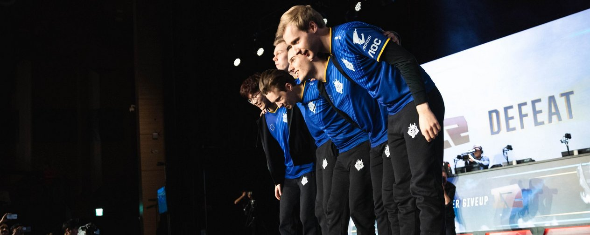
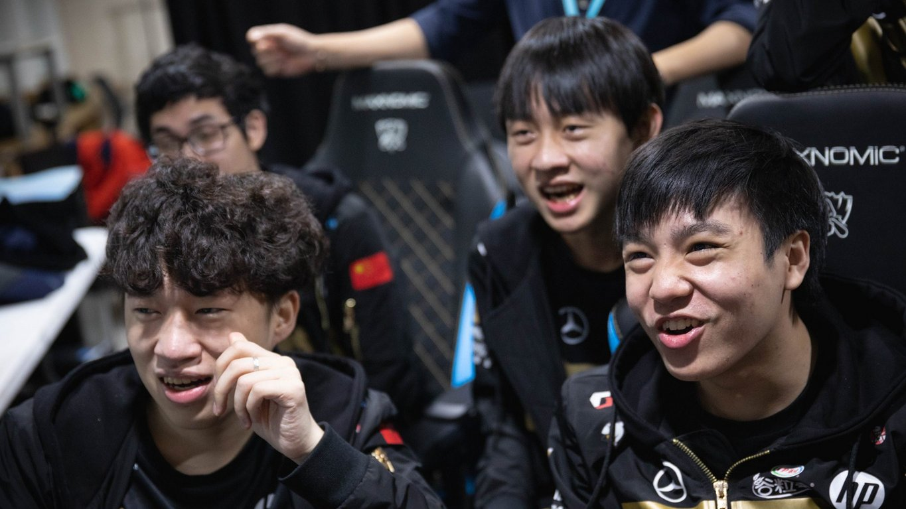

<!-- markdownlint-disable MD033 -->

#G2 ESPORTS' YEAR OF FIRSTS

For both Royal Never Give Up and G2 Esports, this has been a year of firsts.

For Royal in the LPL, this was the first year they won a domestic title with franchise player Jian “Uzi” Zi-hao. It was the first year any team except EDward Gaming won both the Spring and Summer split. It was the first year Royal won an international tournament after advancing to the Grand Final of two World Championships in 2013 and 2014 only to come short. It was the first year they came into a World Championship as favorites, and the first chance Uzi had at completing a “Royal Road” to secure every international title in a year.

On the opposite side of the Eurasian landmass, G2 Esports’ “firsts” came from grief and disappointment. In the first year in the LCS without jungler Kim “Trick” Gang-yun, G2 started afresh with a top-sided focused roster for the first time. G2 have experience with slow starts and long slog splits, dropping games to teams they shouldn’t drop games against, but the true first for them came in the 2018 Spring Split Grand Final when Luke “Perkz” Perkovic left the stage without the title.

G2 then completely lost the chance at the trophy in the Summer Split with an 0-3 defaet at the hands of a waning Misfits Gaming in the Quarterfinal. After two weeks of poor scrims and struggle behind the scenes, G2 failed to win the regular season, not once, but twice in 2018. Then, for the first time ever, G2 Esports had to play the qualifying gauntlet to even make the World Championship.

Comparing their two domestic roads, one couldn’t blame Royal Never Give Up for laughing when Cho “Watch” Jae-geol drew their Quarterfinal opponents. After all, this was also G2 Esports’ first ever year advancing from Group Stage, and Royal’s players had an even or superior record against the two previous iterations of G2.

But that should have been a sign that, for both organizations, the string of firsts was far from over.

In their last two appearances at the World Championship, G2 Esports didn’t advance past the first hurdle of competition. They always faltered, and much of it came from doubt in what they had been working on for the tournament itself.

At the conclusion of the 2018 World Championship Group Stage, then Head Coach Joey “YoungBuck” Steltenpool sat with me in the cold, white-tiled interview roam watching the last game of G2's group between Royal Never Give Up and Samsung Galaxy. He told me about regrets from the 2016 and 2017 runs. He focused on G2's reputation as a best-of-five team that started slow.

“[In 2016, the problem] was we always played through bot lane and mid lane winning and top lane playing tanks,” YoungBuck said. “In the bootcamp, we completely changed that and we were only playing Elise-Jayce, Elise-Renekton, really strong top lane two-v-two. In scrims, it would work. ... In the first game against CLG, we played this style. We got the lead in top lane. He was 2-0 or something, and the team didn't forfeit [like they would in a scrim], and we had to play it out. Then we realized we're actually missing macro.”

As for 2017, YoungBuck said G2 got tripped by the prevalance of Ardent Censer.

“We were playing non-Censer champions every single game for a very large proportion of our games,” he said. “Other teams started first-picking Lulu and getting away with it, so our team had to hit the brakes and actually read the meta.”

Based on G2’s World Championship games in 2018, that hasn’t happened this year. One might hazzard that the removal of funnel comps slowed down G2’s progress in Summer, but Perkz insisted the team hardly practiced funnel in scrims regardless. G2’s crash in the tie-breaker matches leading up to Playoffs and 0-3 against Misfits was the last fans truly saw them struggle.

G2 otherwise kept their fascination for 1-3-1 and controlling the top side of the map, using Marcin "Jankos" Jankowski on champions like Gragas that can disengage for the duo lane as the game progresses. Despite an obsession with Kai’Sa and Xayah at the World Championship, Petter "Hjarnan" Freyschuss remained committed — with the exception of a period right before Play-In where he grinded unsuccessfully on Kai’Sa in solo queue  to the likes of Varus, Jhin, and Sivir that bring both utility and heavy wave clear in G2’s preferred style.

This time, G2 remained committed to what had made them succeed domestically. They knew their plan inside and out, and the hesitation in execution from the EU LCS started to dissipate. When G2 Esports got to Group A on the Main Stage, they rattled the trend set by Flash Wolves to play globals trained on bot lane and established a top carry meta that forced the other teams to alter their approach.

European teams have a history of finding and solving the meta before everyone else, but G2 have always faced difficulty finding footing on international ground. For G2, this was the first year the team stuck to their guns and didn’t get shaken apart by translating scrims to stage. This was the first year G2 came into the Group Stage with a Game One win instead of having to claw back a stable record from a deficit.