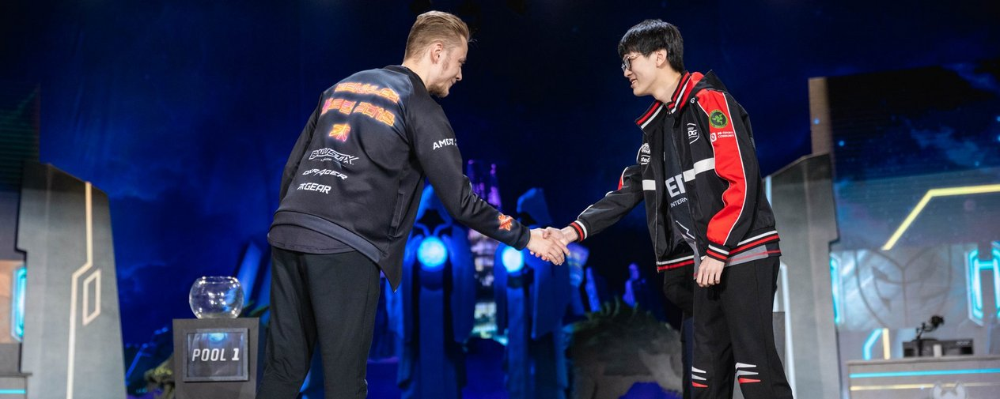
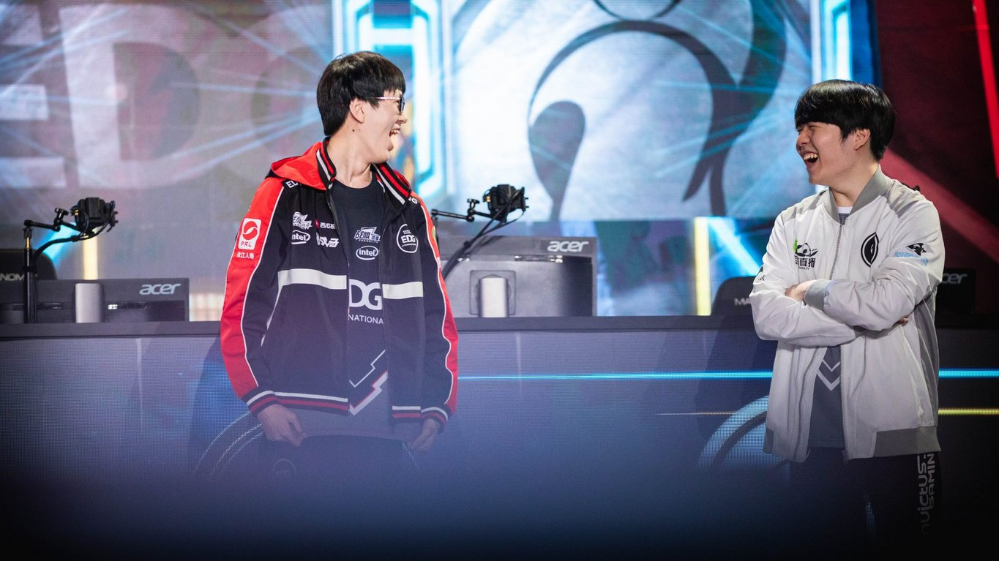
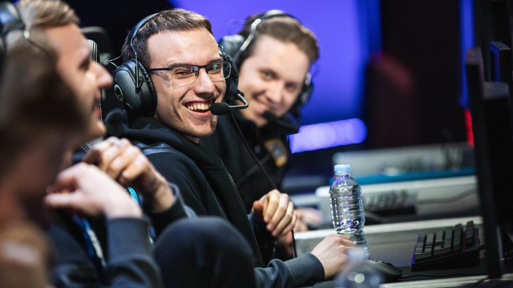
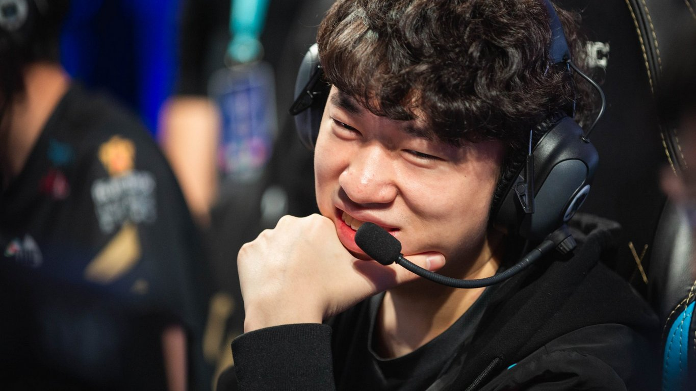

<!-- markdownlint-disable MD033 -->

#CHINA AND EUROPE: THE REAL RIFT RIVALS

China and Europe have spent years as the most competitive contenders for second best, but this year, as Quarterfinals will show, only first will satisfy.

Rift Rivals began in 2017 to bring more international competition between historic combatants. The Chinese and South Korean teams warred with each other in online events since the dawn of League of Legends, while Europe and North America cemented their rivalry over bouts of English language banter and competition that predated even the first season championship.

Yet in the background, when it comes to the World Championship, a much more neck-and-neck competition roiled. Since the LPL’s inclusion in the World Championship in Season 2, Group Stage has served primarily as a battleground between the major regions with the two largest population bases: China and Europe.

Though the LPL no doubt sees itself as a true rival to the LCK, and NA and EU LCS fans have warred for years on Reddit, when it comes to the World Championship, EU and LPL lead the charge in the constant struggle for second best. Both consistently qualify at least two competitors for the bracket stage. Europe has thrice denied an LPL favorite a first seed in Quarterfinals in a South Korea-less group, the Chinese have four times felt like the final obstacle in a European team’s qualification after a grueling back-and-forth.

It has always been close. The single head-to-head record for European and Chinese teams at a World Championship since Season 2 is 24-19: only slightly China favored. 15 Chinese teams have appeared in World Championship bracket stages, and 12 European teams have done the same.

This year alone, the EU LCS is ahead 3-2, and with two LPL vs EU LCS quarterfinals to christen the 2018 World Championship bracket, the record could close completely.

Even more fitting, this year feels different. Both EU LCS and LPL fans, enlivened by the Group Stage brawls, know that, this year, it isn’t just about second place. Both regions have a team analysts wouldn’t hesitate to call potential champions.

This year, League of Legends’ most competitive regional rivals won’t accept anything less than first.

The battle between Royal Club and Fnatic, the two regions’ first seeds, is a storied one in and of itself. It began with Royal’s first World Championship appearance in 2013 and has since then three times (including this year’s Mid Season Invitational) ended in Fnatic licking their wounds in the bracket stage. After Fnatic’s 2-1 climb over Invictus Gaming in Group D, the match feels like it could be closer now -- but, fittingly, if fans want to see it, they have to wait for the Grand Final first.

Aside from Royal and Fnatic’s head-to-heads, bracket stage has actually historically favored the European squads. Since 2012, European teams have a 3-0 series record against Chinese teams at World Championships. Granted, two of these events were Moscow 5 against Invictus Gaming and CLG EU against Team WE in Season 2.

But more recent tape has both Fnatic and G2 Esports, the EU LCS’ two remaining representatives, besting LPL teams in best of fives. Last year, G2 overcame Team WE 3-1 in a best of five after WE defeated them twice handily in Group Stage. In 2015, Fnatic crushed EDward Gaming 3-0, and a reprisal of that match will come again this year on the 21st of October.

##HISTORY SAYS GO MID, G2
But before that, G2 take the stage against LPL’s giants on the 20th. This won’t be G2’s first encounter with Royal either, as their battles began in the 2016 Mid Season Invitational, the year most of their fans shudder to remember. While eyes will flick to the bottom lane with lolesports Rank 1 player Jian “Uzi” Zi-hao in enviable form, only one player from each team is guaranteed to remain from RNG and G2’s first 2016 encounter: mid laners Luka "Perkz" Perković and Li "Xiaohu" Yuan-Hao.

As a precursor to Perkz and Xiaohu’s first encounter, Perkz committed what many will remember as his first public image fumble when he told theScore Esports “I don’t think Asian mid laners are better than European ones.”

Certainly not a controversial statement, but it gave Chinese fans fodder when Xiaohu ended G2’s first encounter with a score line of 5/0/5 on Azir, and Perkz came away tied for the most deaths on his team and with only one kill contribution to his name. Perkz performed better in the second match, but G2 bowed out of the tournament without a win against RNG.

Perkz had to wait a full year to get his revenge in the Group Stage of the 2017 World Championship. Though most of the focus trained on bottom lane’s Jesper "Zven" Svenningsen and Uzi, Perkz opened the game for his team with Corki so that G2 could transfer pressure. Though RNG, until that point, maintained a pristine 3-0 record against G2, Perkz and his team triumphed to have the final say and give RNG their only loss of the 2017 Group Stage.

3-1 to RNG doesn’t seem an unlikely prediction for the two teams’ first best of five encounter this year. After all, Petter "Hjarnan" Freyschuss and Kim "Wadid" Bae-in aren’t the duo to effectively punish Royal Never Give Up’s bottom lane the way Team Vitality did in the Group Stage. But the manner in which G2 Esports want to play out their game strategically actually makes the team a better theoretical matchup into RNG than Fnatic.

Most know RNG best for their clutch 5v5 team fighting around star AD Carry Uzi, but they shine best when Xiaohu and top laner Yan “Letme” Jun-ze can play side lanes well. RNG often will push side lanes past river to get pressure first before Uzi walks forward to clear mid lane. That keeps their star carry from getting collapsed upon and dying in an inopportune moment, yielding a Baron.

That’s why the key matchup will fittingly still come down to Perkz and Xiaohu if G2 are to have a chance. Even in RNG’s 2017 World Championship match win against G2, the Chinese team focused on securing a heavy pushing mid in Jayce for Xiaohu to snowball and ensure side lane pressure in the mid-to-late game. G2’s best hope for having a favorable map setup means pushing the game through mid and top to shut down RNG’s ability to get side lane pressure: something they love to do naturally anyway.

And in proper tradition, this year Perkz again ramped up the stakes for a Chinese and European encounter on Twitter by jokingly suggesting another Chinese team may have leaked Gen G’s level one to RNG. He’s since apologized and proclaimed his respect for the entire region of LPL, but many Chinese fans actively wanted to see this matchup in Quarterfinals as a result. The backdrop will no doubt add a drop of intrigue to the results and train eyes even harder on the mid lane matchup between Perkz and Xiaohu.