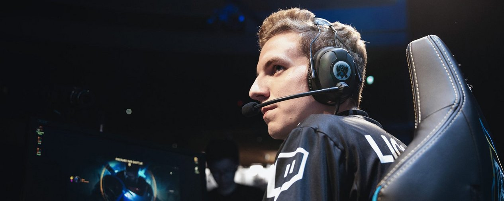
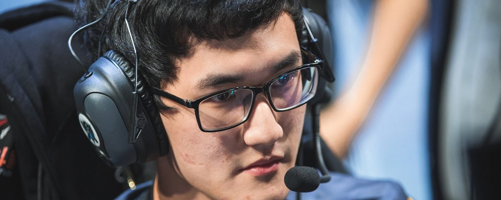
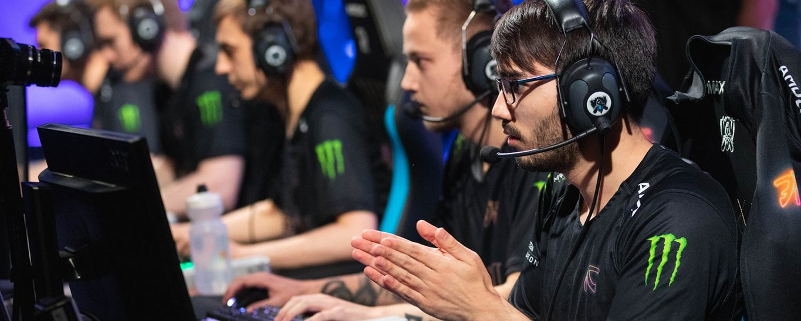
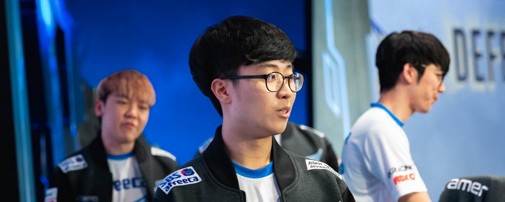

<!-- markdownlint-disable MD033 -->

#EIGHT PATHS TO THE TOP

Only eight teams remain. Here's a look at the driving force behind these players’ championship aspirations.

Afreeca Freecs’ Mowgli and Kuro sit hunched over their phones as they await their turn for broadcast interviews. Mowgli’s blonde hair curves around his head to make him look like a little lion -- it is, I think, kind of fitting for a jungler. Then, without a word, he raises his left arm high into the air as if to stretch before pouncing down around Kuro’s shoulder. He mumbles a few words and like that they embrace for a long moment. And then, even more quickly, the moment passes. As have thousands of moments like that through the year.

This is what I thought of when I sat down to think about what motivates these players. Yes, there is the hyper-competitive drive to win -- the little drumbeat that woke Crown up in the morning before he practiced for 18 hours a day in the scorching heat of Sao Paulo, thousands of miles away from his home country.

There’s the sense of finding oneself that Zig spoke to me about when he explained how over the last offseason, he was shopping at a grocery store and realized that the cashier could have been him. How he realized he had nothing else.

There is Scout’s mom waving flags in the crowd for her son -- perhaps the sole Korean face in her vicinity cheering for the Chinese opposition as her son's team delivers KT’s sole loss to them. There is Wunder’s tall parents towering over the crowd, and there is Caps’ father, silver hair and all, donning a yellow Fnatic jersey with his son’s namesake sprawled across the top of his back.

There is Xmithie’s dad waiting to high five his son and his team at the NA LCS studio every weekend. There are girlfriends backstage. There are owners in the front row and coaches listening in on comms.

And everywhere you turn in Busan’s Bexco stadium, you will find a fan -- some who’ve set up fan booths around the arena with little chocolates and instructions on how to correctly cheer a chant. These are the same people who turn into one giant blur of lights and sounds that roar for the players as they are introduced -- some for the very first time on a stage so large -- in a country that, for the most them, was never even in their imaginations when they first hit the play button on League of Legends.

For now, though, we are still in the moment for eight teams. Eight of them are still fighting for something or someone. This is better highlighted by G2’s Wunder, who says, “It’s a really exciting to share a hotel with all the other teams, and then you see half of them suddenly leave. And you’re left among the Top 8 in the World.”

Here’s a look into what’s still on the line.

RNG’s jungler Karsa says, about the Flash Wolves being eliminated, “We’re really good friends out of the game, so they didn’t want me to be sad because of their failures. So they didn’t pass their sadness onto me. They just wanted to help me, so they gave me all their snacks and cup noodles. I’ll keep them in mind for a better result this tournament.”

The decision to leave the LMS surely was not a light one for Karsa, who spent years as a spear bearer for the Flash Wolves. They’d even built a reputation as the “Korean Killers” thanks in large part to Karsa’s dominance as an aggressive jungler. But in terms of chasing a championship, Uzi’s team has been closer than any other non-Korean team in the world through the years. It's hard to blame him for chasing it in a window where he's still good.

This year is his best chance yet to win it all. There’s a ton on the line for RNG, who’ve maybe begun to understand the type of pressure that plagued SKT during their peak -- the more you win, the higher the expectations. It’s never enough for fans. They are always asking what’s next. And RNG has been on the winning side for MSI, Rift Rivals, and the Asian Games.

What's next is supposed to be Worlds. You could see the pressure even in the Group Stage. Despite winning the tiebreaker to secure first place on Day 5, there was hardly a smile on their faces as the camera panned to them after the match. I think they’d expected to go undefeated in the group, but shocking losses to C9 and Vitality cracked the shroud of fate that had maybe pulsed through their blood before the day had begun. What had started to feel more and more like “their year” was now much less certain.

Karsa’s role on the team has evolved through the year, as has his playstyle and personality. At the beginning of his time with RNG, he says he tried to emulate what mlxg was doing -- he tried to learn his picks and his style to best accommodate the team. “But after a while,” he says, “I learned he’s good at [his style], but when I play that style, it’s weird. [I learned] there’s absolutely two directions for us to go.”

And beyond that in-game nuance, he feels like he’s matured a lot as a person. “I think the biggest difference for me is my mentality. On the Flash Wolves, I was fierce and a little aggressive, but after joining RNG… I’m smooth -- like a ‘good man character’ on the team thanks to our coaches. They taught me a lot -- in and out of the game -- how to be an adult and communicate with teammates in the game or with others in my daily life.”

The evolution of this year’s RNG squad has revolved greatly around how Karsa and mlxg complement each other. Karsa now plays a more stable role for the RNG roster -- his tempo is much more even-keeled and less volatile than his counterpart, mlxg. But what we saw was mlxg’s gravitation towards chaos was the exact dose RNG needed to combat some of the blind aggression thrown at them by the likes of Cloud9 and Vitality. Without one or the other, this team might not even be alive right now.

Karsa adds this about his relationship with mlxg: “If there’s a ranking of junglers, then I want me and mlxg to simultaneously be #1. If there’s no mlxg, there’s no me.”

“Some of my teammates were cocky and thought we could get first place,” says Fnatic support Hylissang. “I just thought we wouldn’t be able to win five games straight [after losing the first game to IG]. I didn’t expect it, but I guess we did it.”

Fnatic’s run through the Group Stage means they’re now the favorite to make it to the Finals from their side of the bracket. I asked Hyli if he felt like they were the favorites or what he thought their odds of making it would be, but he quickly denied me and said he didn’t want to jinx it -- this a stark contrast from some of the bold proclamations made by his teammates. It actually made me even more confident in Fnatic’s chances -- to have a contrasting voice on the team is a good thing for keeping things tempered.

It’s been a long personal run for Hylissang, who spent years toiling on a middle-of-the-pack Unicorns of Love squad that never managed to make Worlds. “Winning my first EU LCS after [struggling] on the Unicorns of Love was a huge relief for me as a player,” he says. “Whenever I was in UOL and we failed, it was really hard for me because I didn’t know if it was me who made the mistake. When you lose, everyone is involved, but after losing so much and not making it, I felt like it was my bad.”

I think, sometimes, lost in the grandeur of the Worlds stage where all the biggest names gather are the stories of some of the under-the-radar guys. Especially now that we’re in the Quarterfinals -- there are still players who’ve spent much more time struggling in the shadows rather than shining on a stage like this. Hylissang is just relieved that his team has made it this far -- a lot of it has been validating for him as a player.

It’s difficult for me to imagine the mental burden of being a pro but having to watch Worlds from the sidelines each year. I wonder how often they dream about standing on that stage. I wonder how many of them immediately queue into a game after the stream ends. And then, now that a player like Hylissang has made it to such an elite stage, I wonder how long it will take for him to be able to look back on this and appreciate what he’s accomplished.

He lights up when I ask him about seeing such a large crowd cheering for him and says, “It’s really fucking awesome -- I don’t know how to describe lifting the trophy and playing on stage. It’s an incredible feeling. That’s what we -- the players -- live for.”

The Afreeca Freecs wear a little sponsor patch on their jacket that says “Plain Vanilla Investment.” I thought this was funny because they had some of the most controlled games in the Group Stage -- especially on second half of the round robin as they dominated their opponents. They played in a lot of low-kill games, and the gold count in their games was pretty even for a large majority of the Group Stage. It was, if you will, a plain and vanilla style that led them to the Knockout Stage. A fine investment.

The first thing I tell AFS top laner Kiin is that my name is Kien (pronounced the same way) -- when I hear the casters call his name on the rift, I can close my eyes and pretend, if only momentarily, that it’s me who’s on that stage. And so in that light, I tell him I am rooting for him. A fact that becomes only more true as he spends a bit of the interview talking about how he’d like to earn the support of more fans.

In responding to criticism levied at AFS so far, he says, “It is true that we underperformed in groups -- I just hope to show a better performance in Quarterfinals to get better compliments from analysts and fans.”

Combined with GEN.G, the two teams’ starts caused a bit of panic among Korean fans who’ve become accustomed to being at the top of the pecking order. AFS did their best to remain positive through the opening days, though. He says they focused more on communication in the opening days -- not on game related things necessarily -- but just on cheering each other up to be become more encouraged. Only after they overcame morale issues did they begin to focus more on macro and strategy again.

The matchup against C9 will be a clash of styles for sure -- both in and out of the game. Kiin says, “If we get caught playing other games, our coaches will punish us a lot -- so I can’t even imagine playing other games.” It’s a little exaggerated at this point, sure, but Cloud9 is definitely a much more free-spirited team than AFS when it comes to how they approach their work. And if AFS is a lesser known entity thanks to never making it to Worlds before, then Cloud9 is decidedly a behemoth when it comes to popularity.

Even Kiin was captivated by the wild antics of C9 on the Rift. He says, “I really enjoyed watching [Licorice’s] Hecarim game -- the most amazing thing was that Licorice made a mistake in the early game but he was able to make a comeback and perform really well in the mid and late game.”

A deep run at Worlds can generate a lot more fanfare for the Afreeca Freecs. And for Kiin especially -- what we do know about him is that he was the #4 ranked player in the world coming into Busan. The top laner earned a reputation as a dominant carry-oriented player for AFS, and here’s a golden opportunity for him to demonstrate his mettle.

When I ask him if he’s had many memorable interactions with the fans at the event so far, he says, “To be honest, I think our team is not that popular -- we don’t have many fans so those kinds of moments haven’t happened to me yet. To be one of the best teams in the world, we need to push through to Finals.”

Defending the Summoners' Cup for Korea on home turf would be one surefire way to earn some new fans.