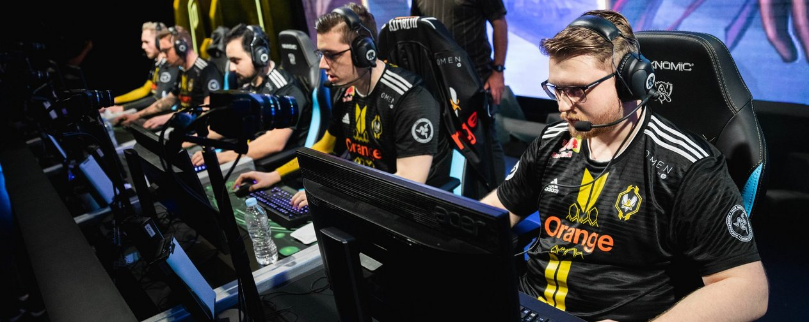
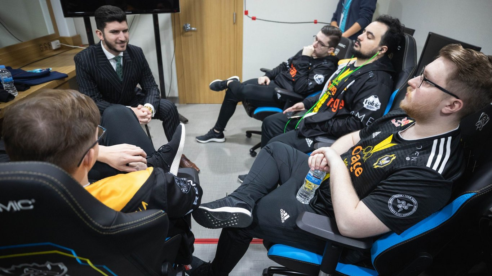
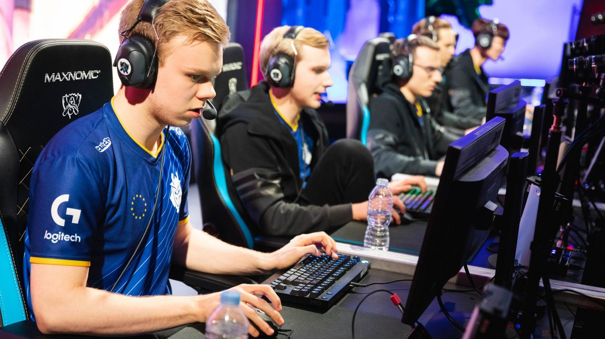

<!-- markdownlint-disable MD033 -->

#THE REGION OF PERENNIAL ROOKIES

The EU LCS teams came to the World Championship with one sole intention: play their own game.

Mettle forms in the furnace of Best of 1. Bo1 sets allow a domestically formed strategy to flourish without room to adapt and require more studious preparation than an extended series in which teams can test counters and then ban out difficult champions. Doubling down on the competition, the 2018 World Championship Group Stage added the twist of eight consecutive days of play without the typical three day break.

For the EU LCS and its history, that only means good news. In 2012, Moscow Five set a new standard for jungle and support control. In 2015, though their lane swap meta was internationally scoffed at, Fnatic and Origen made the world adapt. H2k-Gaming brought Caitlyn and the triple lane threat with fast push into the light in 2016. In 2017, Misfits Gaming rejected the Ardent Censer meta and took historically dominant Korean team SK Telecom T1 to five games as a result. Even in Europe’s darkest year, SK Gaming didn’t shy from putting side lane Vayne on display.

Europe is a region that doesn’t accept a meta set by any teams but its own. With the boldness of an eternal student who hasn't been told his approach is wrong, the EU LCS teaches the rest. This year, that felt true when it came to every opponent Team Vitality, G2 Esports, or Fnatic touched, and will have a reverberating effect for the rest of the tournament. G2 and Fnatic advanced above expectation, and Vitality fundamentally changed the way tournament favourite Royal Never Give Up approached their draft.

##VITALITY'S GROUP OF DEATH

The rise of the EU LCS began on Day One of Round Two. After a 1-2 start, Team Vitality unsettled analysts with a Draven and Thresh bottom lane duo that played to the strengths of Amadeu "Attila" Carvalho and Jakub “Jactroll” Skurzyński. Heavy pressure from Xin Zhao prevented Royal Never Give Up from getting their single threat composition off the ground.

Vitality made their World Championship debut all about hitting harder and faster. If any other team enters a game wanting to force fights at any opportunity, they will still lose the first punch to Team Vitality.

RNG, wanting to build double bruiser or double tank compositions with Jian “Uzi” Zi-hao as the only damage threat, encountered immediate difficulty protecting Kai’Sa from single target destroyers Ryze, Thresh, and Xin Zhao. They lost their first game of the World Championship to the EU LCS’ second seed.

##G2 SPLIT THE DIFFERENCE

G2 Esports had already begun to set the meta in Group A. In the second day of Round Two competition, G2 demonstrated that powerful solo laners make team fights a secondary consideration.

Luka "Perkz" Perković’s Akali stumped Vietnam’s Phong Vũ Buffalo after Marcin “Jankos” Jankowski could hardly farm his own camps in the early game. G2 pushed through their side lanes to rectify their only loss in Round One.

Despite losses throughout the day to Flash Wolves and Afreeca Freecs, G2 persevered in the tie-breaker granted by Phong Vũ Buffalo’s upset over the LMS’ first seed representative. Flash Wolves selected Mordekaiser to answer G2’s signature Heimerdinger. Though the Mordekaiser and Tahm Kench lane had responses to the Heimerdinger’s pushing prowess, pressure in both solo lanes prevented Flash Wolves from securing dragons. Heimerdinger became more useful in the late game than Mordekaiser, and G2 secured their spot in Quarterfinals.

G2 didn’t just advance in second seed, they shook Afreeca Freecs and Phong Vũ Buffalo from a lull instituted by Flash Wolves. All three teams (except Flash Wolves) have a star top laner upon which they can hang a 1-3-1 composition. G2’s initial Day One upset over Afreeca established a meta with which Seed One team Flash Wolves could not compete. Afreeca adapted to headline the group.