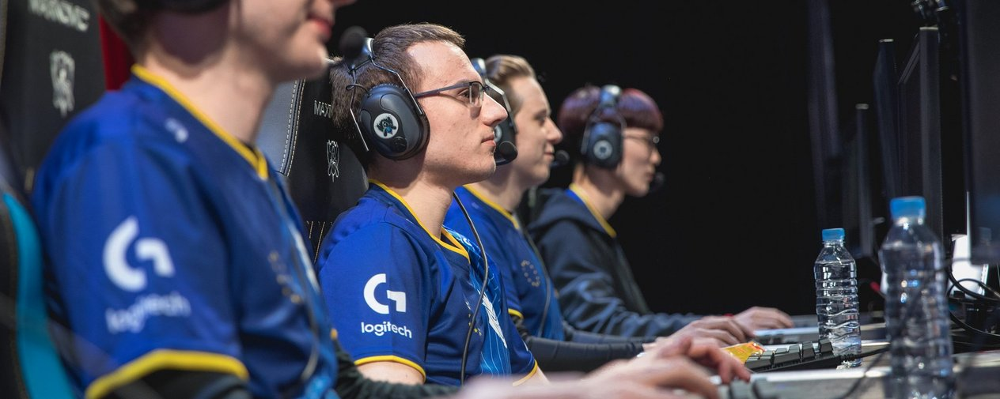
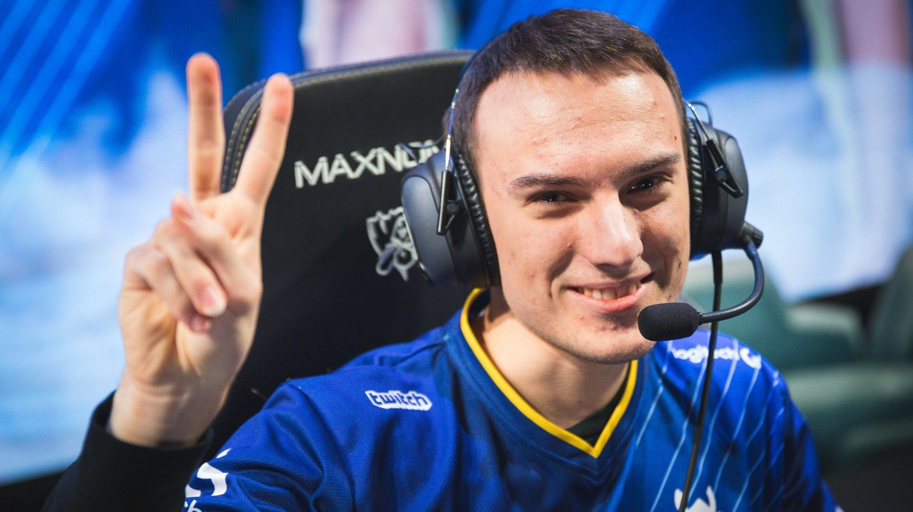
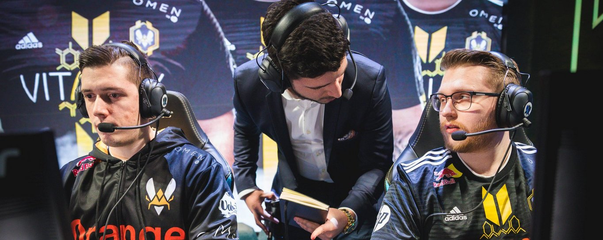
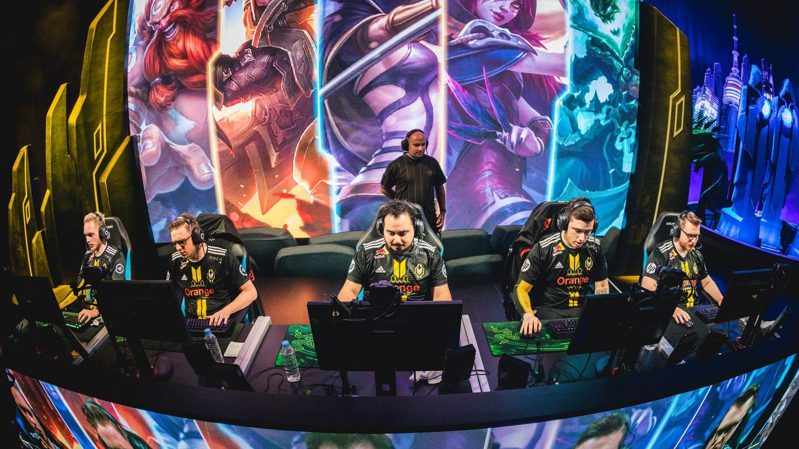

<!-- markdownlint-disable MD033 -->

#IT'S ALL ABOUT THE MID PUSH, MAN

EU LCS teams have had a confusing start in the first three days, but a common factor differentiates wins and losses.

Anyone who consulted the EU LCS team schedule before the commencement of the 2018 World Championship undoubtedly anticipated an outcome along these lines after the first two days of competition.

Fnatic 1-1

Team Vitality 1-2

G2 Esports 1-1

An equally cursory glance of the standings after Day Three wouldn’t, then, raise alarm. But observing that G2 and Vitality didn’t lose to the South Korean teams in their group, but instead to Vietnam’s Phong Vũ Buffalo and North America’s Cloud9, results look less straight forward. If Europe stumbles against the perceived bottom, but reaches new heights to bring down LCK juggernauts, predicting which teams advance to the Quarterfinals requires a new level of investigation.

Limited tape means imperfect predictions, but one can find consistent threads in the EU LCS’ wins. Since before the arrival of Henrik “Froggen” Hansen, who cemented its status, Europe has boasted a reputation for producing the best mid laners in the world. A common theme in the EU wins at Worlds is securing pushes in the mid lane throughout the early game. To ensure they can get out of the Group Stage, that will have to be something EU teams prioritize.

##THE WINS

Europe’s first match on the World Championship stage in 2018 didn’t look favorable on paper. The LCK second seed often looks for good picks across the map, which creates a greater threat for G2 Esports' coined strategy. G2's 1-3-1 execution sometimes features them pushing out mid before their side lanes. In this situation, a freely moving Afreeca Freecs could find picks and flank G2 Esports’ rush forward with the likes of Zoe or Varus.

In the context of the actual game, Petter "Hjarnan" Freyschuss and Kim “Wadid” Bae-in tempered their usual recklessness in approaching the opponent’s wave before their own caught up. Very careful and map-aware play prevented a fast-clearing Taliyah from collapsing on G2 Esports’ bottom lane. But, most importantly, G2 Esports could always threaten a more advantageous trade because Luka “Perkz” Perković’s Syndra hardly gave room for Lee "Kuro" Seo-haeng’s Zoe to breathe. If a trade happened, Perkz could move constrict Kuro to lane, giving G2 more tools for success.

As a result, Afreeca were forced into a position where they had to move Kim “Kiin” Gi-in out of top lane against priority to try to make something happen on the bottom side of the map. This played directly into Martin “Wunder” Hansen’s hands, as he could lap up extra waves of experience and damage his opponent’s turret while his bottom lane played safely. Eventually, Afreeca could not answer Wunder’s pressure in a side lane and could only bleed out or force a disadvantageous fight.

On the same day as G2's success in Group A, Team Vitality secured the first win the "Group of Death", Group B. Team Vitality had the edge in that they can always play confidently and shock a win. In contrast, Gen.G (formerly Samsung Galaxy) prefer a slow ramp-up where they learn things actively from the opponents they face. Even so, a victory for Vitality didn’t come from an aggressive invade attempt or a group gank on the bottom side of the map. Almost all attempts by Vitality to secure an early snowball backfired with global engages from Tahm Kench or Ashe on the part of Gen.G.

But Daniele “Jiizuke” di Mauro kept a lead and a constant push against Gen.G’s Lee “Crown” Min-ho with his fringe Syndra counter pick: Ekko. His pressure shut down Gen.G’s ability to make plays in other lanes and, eventually, Vitality had the resources to pressure their mid lane advantage with force and transition Jiizuke happily into a split-pushing role to which Gen.G could not respond.

While G2 and Vitality faced giants from South Korea, Fnatic's win came against, arguably, North America's weakest seed. The formula didn't change. For Fnatic against 100 Thieves, the question of trading almost never arose, as Rasmus “Caps” Winther’s use of Irelia into Syndra shut down any moves early. He matched the Worlds all time solo kill record of five in a single game and opened the map for Fnatic.

##THE LOSSES

One day of tape was more than enough for Europe’s opponents in the Group Stage to take note of how effectively G2 Esports, Team Vitality, and Fnatic could extend mid lane control to side lanes in the early game.

Neither Phong Vũ Buffalo nor Cloud9 chose immediate level one winning mid lane matchups, but they limited the window of action for their opponents with their picks. Phong Vũ had the opportunity to answer both of G2’s solo lane choices with Vel’Koz, and Cloud9 saved their mid lane choice until last pick. On Day Three, a questionable blind pick on blue side restricted Caps’ influence for Fnatic, and Vitality’s Azir counterpick didn’t account for the kill pressure of RNG’s mid-jungle duo.

While Aatrox can get initial pressure in most matchups, Phong Vũ’s Võ "Naul" Thành Luân selected Vel’Koz after G2 Esports locked in both of their solo lane champions. Almost nothing out-pushes a Vel’Koz post level six, and Phong Vũ used the fact that their mid lane backed first to set up plays around the bottom side of the map. G2 then couldn’t get their top lane Ryze into a position to exert pressure without fearing Phong Vũ’s bottom lane collapsing.

Phong Vũ’s bottom lane and jungle constantly hovered from the mid lane to Phạm "Zeros" Minh Lộc’s lane. They collapsed quickly to back up the Urgot with Leona and Xayah. Though execution didn’t come through perfectly, G2 didn’t have the opportunity of snowballing Wunder in exchange for Phong Vũ’s bottom lane devastation because G2’s ability to get priority in the mid lane was limited.

Meanwhile, over in Group B, Cloud9 identified Vitality’s ability to throw Afreeca into turmoil with an unconventional mid lane pick. As a result, they saved the mid lane matchup as the last pick of the draft, putting Nicolaj “Jensen” Jensen on Galio, a champion that can shut down LeBlanc’s push after first back.

The game became difficult for Cloud9 with smart play from Jiizuke that snowballed LeBlanc, but as the game drew on, Vitality’s opportunities to get picks with their LeBlanc and Jarvan IV combination dwindled. Only Dennis “Svenskeren” Johnsen’s Taliyah presented an opportunity. Meanwhile, Zachary "Sneaky" Scuderi delayed his build with a Banshee’s Veil, but eventually hit a four item power spike with Infinity Edge. Vitality could neither win team fights nor gain effective pressure in side lanes and lost out after a prolonged series of brawls.

While G2 and Cloud9 stumbled in matches they were expected to win, Fnatic crumbled against the giants of their group. Caps blind picked Swain and ended up falling heavily behind Song “Rookie” Eu-jin’s Syndra with a gap of more than 30 creeps before 10 minutes into the match. He barely had the opportunity to move from lane. Fnatic instead wanted to rely on transferring control from bottom lane with Zdravets "Hylissang" Iliev Galabov’s Rakan, but Rookie’s constant push and the threat of Xin Zhao kept the bottom river dark.

Even when Paul “sOAZ” Boyer’s intelligent eight minute Teleport secured Fnatic the first turret and swung the flow of the lane back in the EU LCS team’s favor, iG read their next move to rotate Hylissang mid. iG matched their own support and jungler, using Rookie’s laning advantage to maintain the status quo. 